# OpenHands Multi-Container Development Team Setup

OpenHands offers powerful capabilities for multi-agent development environments, though it requires careful architecture and security considerations to deploy effectively across development teams. This comprehensive analysis reveals both significant opportunities and critical challenges for implementing multi-container OpenHands setups.

## High-Level Architecture Overview

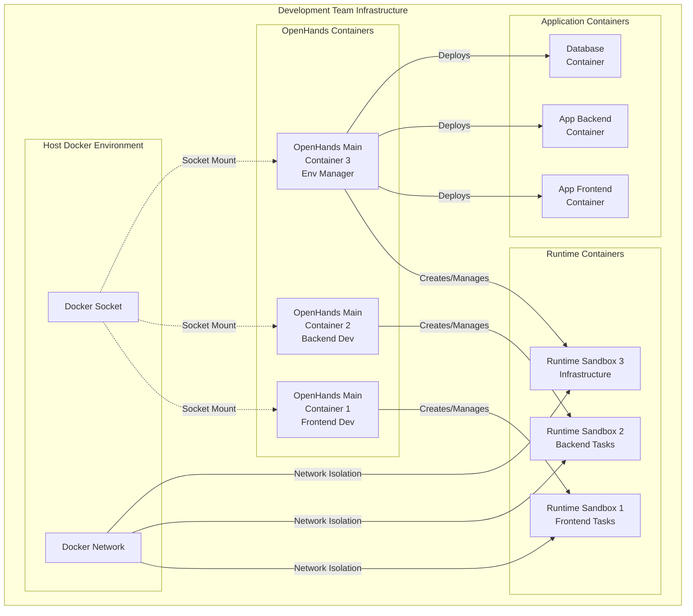

## Architecture fundamentals enable flexible multi-container deployments

OpenHands operates through a **sophisticated client-server architecture** with clear separation between the main application container, sandboxed runtime containers, and specialized agent delegation systems. The platform uses an event-driven architecture where AI agents process requests and execute actions in isolated Docker environments.

### Component Communication Architecture

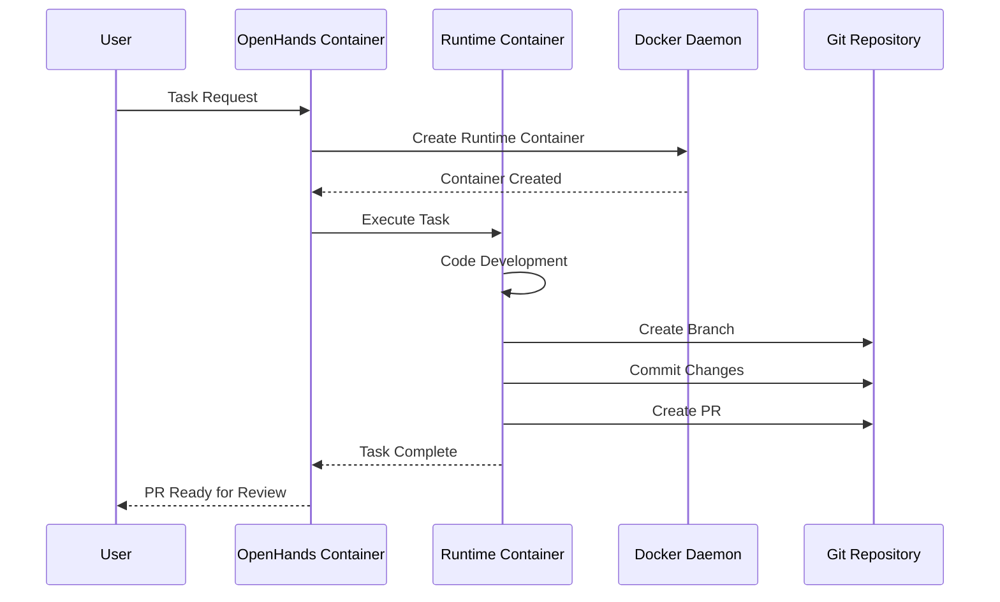

The **container-based runtime system** implements a three-component model: the main OpenHands application container manages orchestration and user interactions, dedicated runtime containers provide isolated execution environments, and communication occurs through RESTful APIs with WebSocket connections for real-time updates. OpenHands uses a **three-tag image system** (source-specific, lock, and generic tags) enabling efficient container reuse and rebuilding strategies.

While designed primarily for single-user deployments, OpenHands achieves multi-container capabilities through **third-party integration solutions**. **Daytona provides agent-agnostic infrastructure middleware** with multiple parallel sandbox environments and resource optimization. **E2B Runtime offers cloud-based secure sandbox environments** with Python and JavaScript SDK support. These partnerships enable enterprise-scale multi-container deployments beyond the basic single-user architecture.

## Role-based container configuration supports specialized development teams

OpenHands supports differentiated agent roles through its **microagent architecture and plugin system**. Development teams can deploy specialized containers for distinct functions:

### Multi-Agent Team Structure

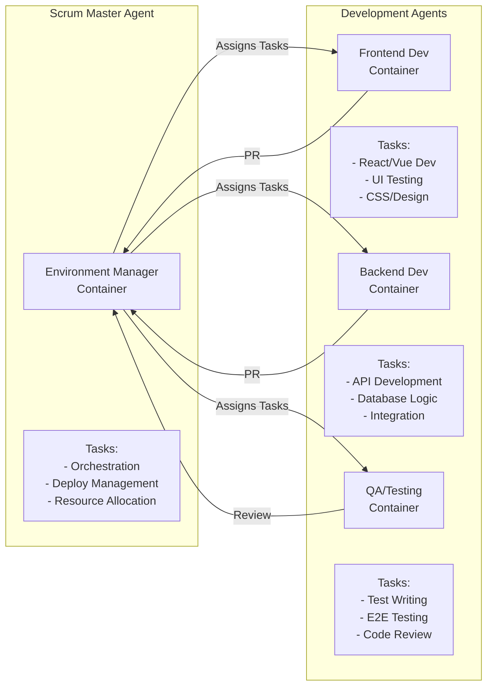

**Frontend development agents** can be configured with web-focused capabilities using the BrowsingAgent for web interface testing and CodeActAgent for JavaScript/TypeScript development. **Backend development agents** utilize specialized runtime environments with database plugins and API development tools. **Environment managers with elevated privileges** operate through DelegatorAgent configurations that orchestrate task distribution and coordinate between other specialized agents.

The **microagent system** enables repository-specific customization through `.openhands/microagents/` directories containing Markdown files with YAML frontmatter. These microagents provide domain-specific knowledge and can be triggered by keywords or remain always active. **Custom plugins initialize when runtime clients start**, associated with `Agent.sandbox_plugins` configuration, allowing teams to create specialized environments for different development roles.

**Container specialization occurs through runtime configuration** rather than different base images. Teams can deploy multiple containers with identical OpenHands installations but different environment variables, plugin configurations, and resource allocations to create frontend-focused, backend-focused, and infrastructure management roles.

## Docker integration presents security trade-offs requiring careful implementation

OpenHands currently relies on **Docker socket mounting** as its primary integration strategy, requiring `/var/run/docker.sock` access to create and manage sandbox containers. This approach provides excellent performance and resource efficiency but introduces **critical security vulnerabilities** - mounting the Docker socket grants root-equivalent access to the host system.

### Security Architecture Options

```mermaid
graph TB
    subgraph "Option 1: Socket Mount (Current)"
        H1[Host System]
        D1[Docker Daemon]
        S1[/var/run/docker.sock]
        OH1[OpenHands Container]
        RT1[Runtime Container]
        
        H1 --> D1
        D1 --> S1
        S1 -.->|RISK: Root Access| OH1
        OH1 -->|Creates| RT1
    end
    
    subgraph "Option 2: Docker-in-Docker"
        H2[Host System]
        D2[Host Docker]
        DIND[DinD Container<br/>Nested Docker]
        OH2[OpenHands Container]
        RT2[Runtime Container]
        
        H2 --> D2
        D2 --> DIND
        DIND -->|Isolated| OH2
        OH2 -->|Creates| RT2
    end
    
    subgraph "Option 3: API Proxy"
        H3[Host System]
        D3[Docker Daemon]
        PROXY[Docker API Proxy<br/>Permission Filter]
        OH3[OpenHands Container]
        RT3[Runtime Container]
        
        H3 --> D3
        D3 --> PROXY
        PROXY -->|Filtered Access| OH3
        OH3 -->|Creates| RT3
    end
```

**Docker-in-Docker (DinD) offers enhanced security** through nested Docker daemon isolation, preventing OpenHands containers from directly accessing the host Docker daemon. However, DinD introduces **10-15% performance overhead** and requires privileged containers with additional resource allocation. The implementation requires separate DinD containers linked to OpenHands instances.

**Recommended security hardening strategies** include implementing **user namespace remapping** to map container root to unprivileged host users, deploying **SELinux or AppArmor mandatory access controls**, creating **isolated Docker networks** for container communication, and establishing **comprehensive audit trails** for all Docker API calls. Production environments should avoid socket mounting entirely, implementing rootless Docker or DinD configurations with proper resource limits.

**Network isolation strategies** involve creating custom bridge networks, implementing container-to-container communication through DNS resolution, and restricting network binding to localhost (127.0.0.1) rather than all interfaces. Teams should implement **dedicated networks for different development environments** to prevent cross-contamination between projects.

## Conflict prevention requires orchestrated coordination between autonomous developers

Multiple OpenHands agents working on the same codebase necessitate **sophisticated coordination mechanisms**. The platform's single-user design means teams must implement external orchestration layers to prevent conflicts.

### GitFlow Coordination Pattern

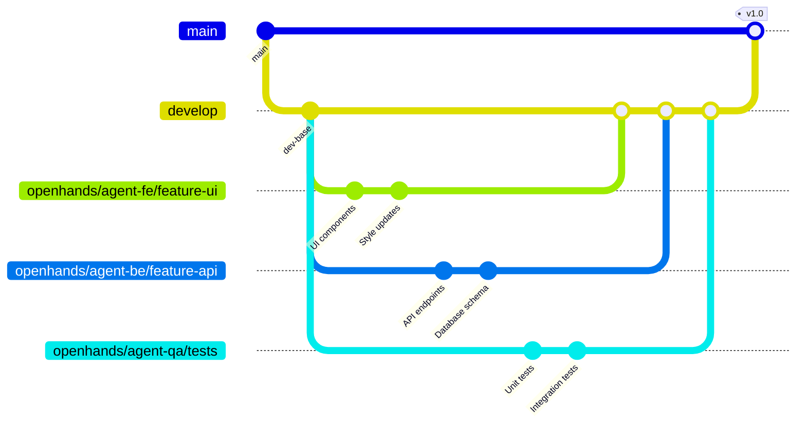

### Agent Coordination State Machine

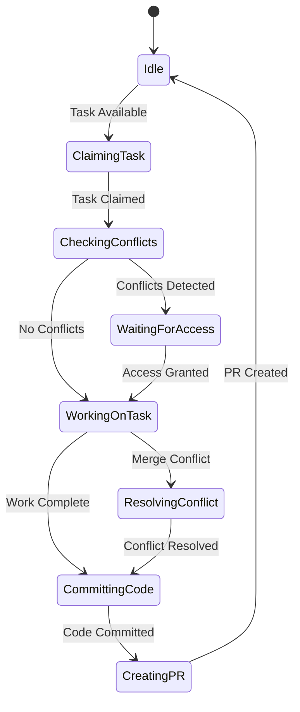

**Effective coordination patterns** include deploying an **orchestrator agent** that manages overall GitFlow coordination and branch strategy, while **worker agents handle specific development tasks** within assigned branches. An **integration agent specializes in merge conflict detection and resolution**, creating a hierarchical structure that prevents simultaneous file modifications.

**Proactive conflict prevention strategies** involve implementing **file-level coordination through code ownership models**, breaking complex features into non-overlapping subtasks assigned to different agents, and establishing **agent-to-agent communication protocols** for coordinating file access. **Temporal coordination** through sequential task processing, lightweight file locking, and time-windowed operations minimizes overlap between agents.

**Advanced conflict detection** integrates with tools like **CodeRabbit, Bito AI, and PR-Agent** for proactive conflict identification. These systems detect not just line-based conflicts but logical inconsistencies and dependency relationships that could cause integration issues.

## GitFlow implementation enables automated branch management and pull requests

OpenHands agents can effectively implement GitFlow patterns through **automated branch naming conventions** using the `openhands/` prefix, creating clear identification of AI-generated branches. **Agent-specific workflows** involve each agent creating dedicated feature branches (`openhands/agent-{id}/feature-{task}`) while working against shared development branches with automated merging.

**Pull request automation capabilities** include direct GitHub/GitLab API integration for branch management, **atomic commits with AI-generated commit messages** following conventional commit standards, and **automated PR creation with comprehensive descriptions**. Integration with **PR-Agent and similar tools enables automated code review** with line-by-line suggestions and security vulnerability detection.

**Automated merge strategies** implement intelligent three-way merging that considers the intent of each agent's changes. **Context-aware merging uses LLM capabilities** to understand code semantics during conflict resolution, while **conflict scoring prioritizes issues** based on impact and complexity for human review. Resolution hierarchies escalate from automated resolution through agent negotiation to human intervention for critical conflicts.

**Repository access control** implements graduated permission levels: read-only agents for analysis, developer agents with branch creation rights, and maintainer agents with merge capabilities. **Token-based authentication** uses GitHub/GitLab personal access tokens with scoped permissions, maintaining clear agent identity management and audit trails.

## Infrastructure as Code generation supports comprehensive deployment automation

OpenHands demonstrates **strong capabilities for generating infrastructure configurations** across multiple platforms. The platform can create **Terraform HCL files, AWS CloudFormation templates in JSON and YAML formats, and comprehensive Kubernetes manifests** including deployments, services, and Helm charts.

### IaC Generation and Deployment Flow

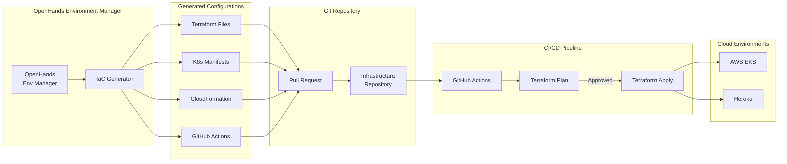

### Multi-Environment Deployment Architecture

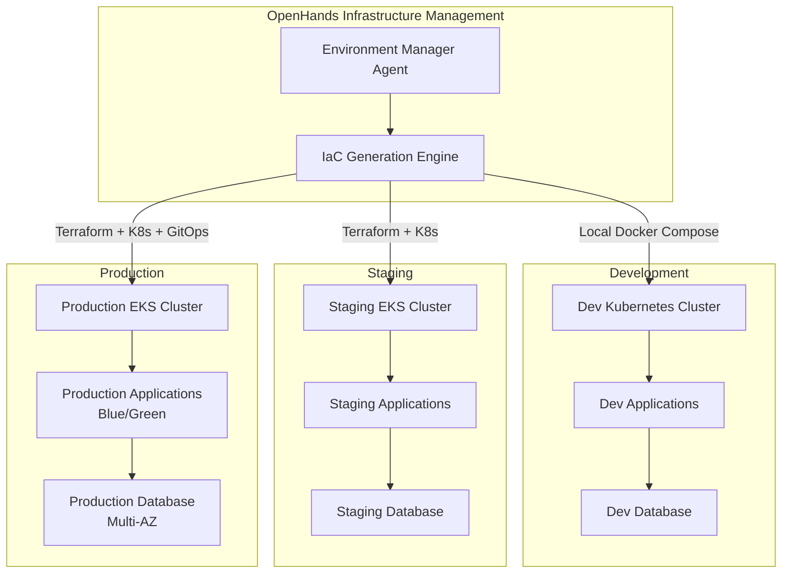

**AWS EKS integration** occurs through generated infrastructure configurations rather than direct API access. OpenHands can create **EKS cluster definitions using Terraform or CloudFormation**, generate node group configurations with autoscaling policies, configure networking components including VPC and security groups, and set up **IAM roles and policies for cluster access**. The platform generates Kubernetes manifests for application deployment and implements GitOps workflows with tools like Argo CD.

**Heroku deployment automation** includes generating **Procfiles for process definition, heroku.yml files for container-based deployments**, configuring buildpacks and dependencies, and creating GitHub Actions workflows for automated deployment. OpenHands supports **Git-based deployment strategies**, Docker container deployment, database configuration, and environment promotion workflows.

**Infrastructure provisioning workflows** follow a **configuration-first approach**: generating infrastructure configurations, creating CI/CD pipeline definitions, setting up deployment automation scripts, and configuring environment promotion and rollback strategies. This approach maintains separation between configuration generation and deployment execution, leveraging existing CI/CD infrastructure and security policies.

## CI/CD pipeline integration creates deployment configs for GitHub Actions execution

OpenHands provides **robust GitHub Actions integration** with built-in GitHub Actions for automatic issue resolution and comprehensive workflow generation capabilities. The platform can create **complex CI/CD workflows with multiple jobs, dependencies, and conditional execution** based on branch patterns and file changes.

**Integration patterns** involve OpenHands generating infrastructure configurations and deployment workflows while **actual deployment execution occurs through established CI/CD systems**. This approach maintains **audit trails, approval processes, and GitOps workflows** while leveraging AI-generated configurations.

**Example integration workflows** include Terraform planning on pull requests, automated deployment on main branch merges, environment-specific deployment strategies, and **rollback mechanisms for failed deployments**. OpenHands can generate **environment promotion workflows**, blue-green deployment strategies, and **comprehensive deployment documentation**.

**CI/CD best practices** implemented by OpenHands include **incremental infrastructure changes**, integration with Git workflows for versioning, **automatic documentation generation**, and incorporation of security best practices in generated configurations. The platform supports **multi-environment configurations** with environment-specific variables and promotion workflows.

## Local container orchestration requires careful resource management and networking

Effective local orchestration involves **Docker Compose configurations** for multi-container development environments. Teams should implement **custom bridge networks** for container isolation, **named volumes for persistent data**, and **appropriate resource limits** for CPU and memory constraints.

### Network Architecture for Multi-Agent Setup

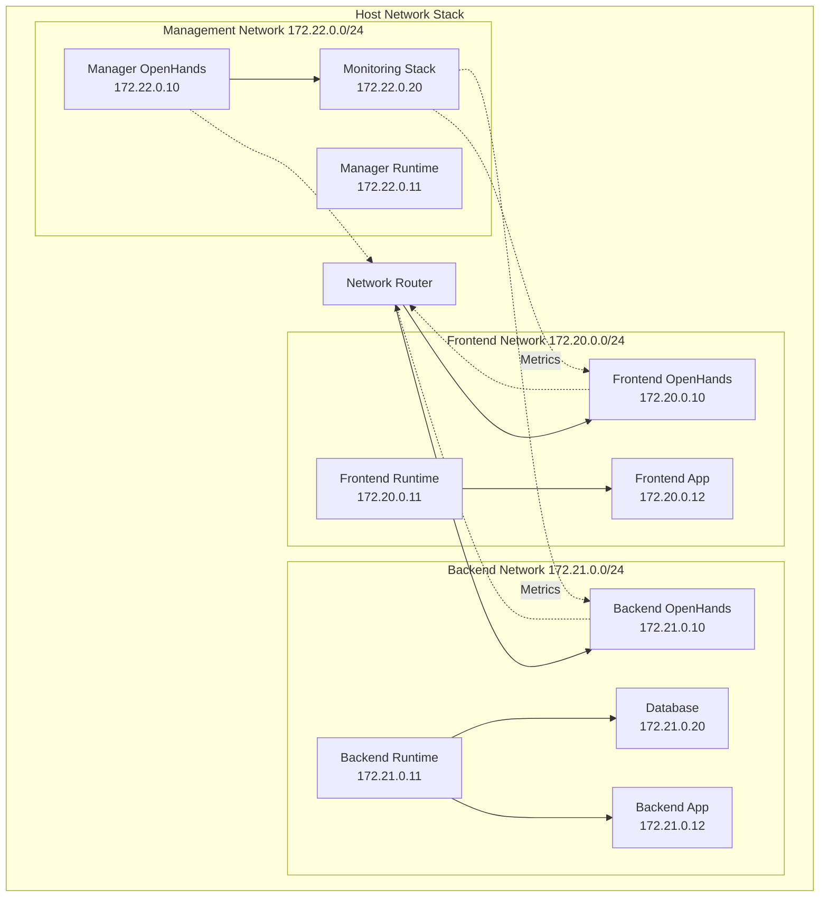

### Resource Allocation Strategy

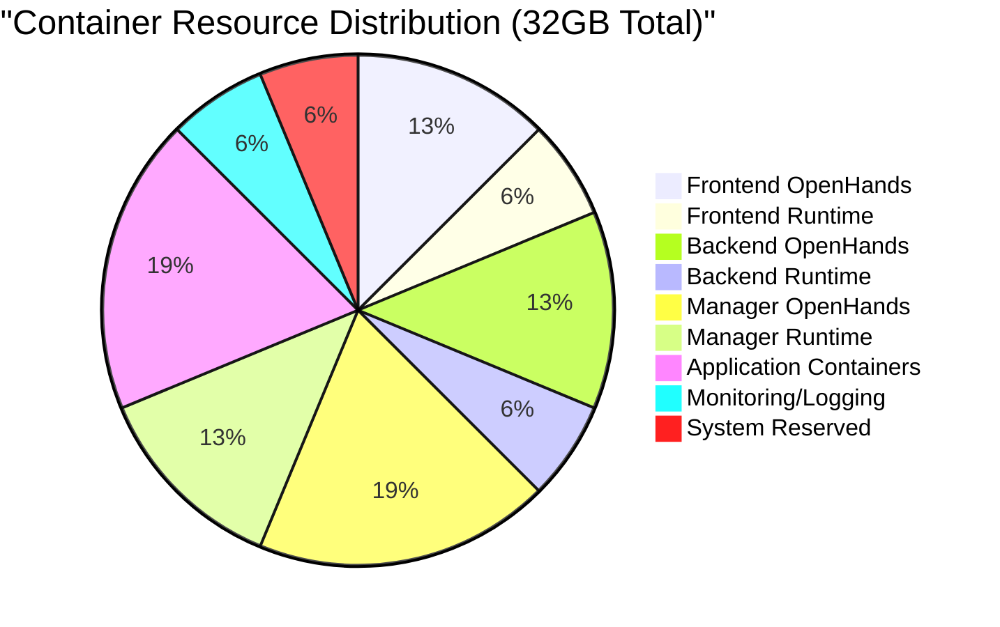

**Container lifecycle management** requires automated cleanup strategies for stopped containers, unused images, and networks. **Health checks and monitoring** ensure container availability and performance. **Development workflow optimization** involves custom networks for different environments, volume management for code synchronization, and **resource allocation based on development team size**.

**Network architecture** should implement **container-to-container communication through DNS resolution**, service discovery mechanisms, and **traffic isolation through separate networks** for frontend, backend, and database components. **Load balancing strategies** distribute requests across multiple agent containers with session affinity for ongoing work.

**Scaling considerations** include horizontal scaling through container replication, **auto-scaling triggers based on CPU and memory utilization**, and **high availability through multi-zone deployment** with shared storage for workspace persistence.

## Security considerations demand comprehensive access control and monitoring

**Critical security risks** center on Docker socket access granting root-equivalent host access. **Mitigation strategies** include implementing **Docker API proxies with permission filtering**, using dedicated Docker-in-Docker setups, and **restricting network binding to localhost only** in production environments.

### Security Monitoring Architecture

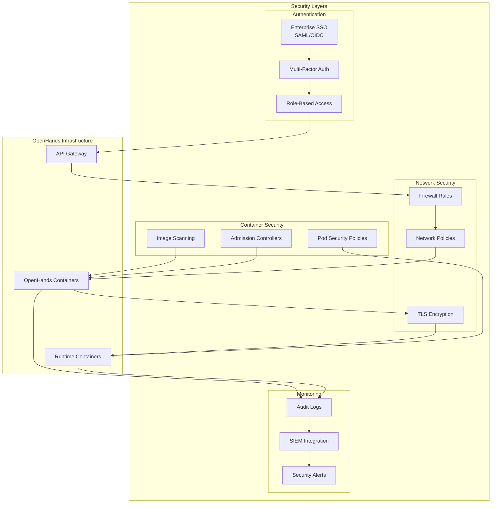

### Access Control Matrix

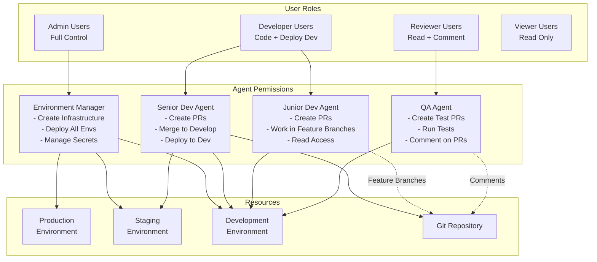

**Access control frameworks** require **OAuth integration for enterprise SSO**, API key-based access for programmatic usage, and **role-based access control (RBAC)** with developer, reviewer, and admin permission levels. **Agent privilege isolation** involves separate container namespaces per user/project, resource quotas per agent, and **network segmentation for agent communications**.

**Monitoring and logging strategies** implement **container-level monitoring with Prometheus and Grafana**, log aggregation through FluentD or Fluent Bit, and **comprehensive agent activity tracking**. Key metrics include container resource utilization, agent task completion rates, network traffic patterns, and **Docker API call frequency monitoring**.

**Production security hardening** involves **enterprise-grade authentication systems**, static IP configurations, **Cloud Operations Suite integration**, and regular security audits. Teams should implement **disaster recovery procedures**, cross-region replication for critical deployments, and **comprehensive backup strategies** for workspace data and agent states.

## Enterprise deployments demonstrate scalable multi-agent patterns

**Shakudo Integration** provides enterprise-grade OpenHands deployment with VPC and on-premise infrastructure options, **enterprise security and compliance controls**, and deployment time reduction from months to weeks. **Daytona Platform** offers agent-agnostic middleware infrastructure with **isolated secure environments**, multi-agent parallel execution support, and dynamic workspace management.

### Enterprise Deployment Architecture

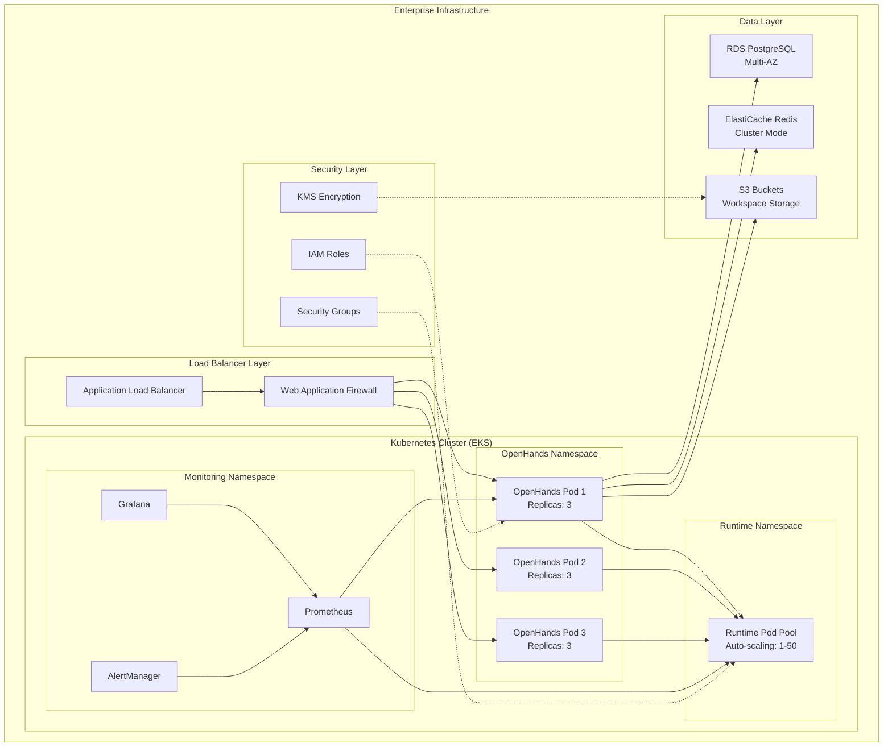

### Scaling Patterns

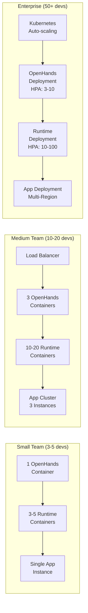

**Google Cloud production deployments** utilize Cloud Run, Secret Manager, and Load Balancer components with **static IP configuration and custom domain integration**. However, serverless limitations create challenges for Docker socket access, requiring alternative architecture patterns.

**Multi-agent system architectures** include **hierarchical master-subordinate models** with coordinator agents and specialized agents for different tasks, and **decentralized peer-to-peer networks** with fault-tolerant design and dynamic agent discovery. These patterns enable **enterprise-scale deployments** with proper resource allocation and coordination mechanisms.

**Infrastructure requirements** include minimum 4 vCPU and 8GB RAM per agent, with recommendations for 8 vCPU and 16GB RAM for complex tasks. **Storage requirements** involve 50GB+ per workspace with fast I/O capabilities. Scaling strategies implement **Kubernetes deployments with horizontal pod autoscaling** based on CPU, memory, and queue depth metrics.

## Conclusion

OpenHands multi-container setups offer powerful capabilities for development teams willing to invest in proper architecture, security, and coordination mechanisms. Success requires starting with simple single-agent deployments, implementing robust security controls around Docker access, establishing clear agent coordination protocols, and leveraging enterprise integration patterns through platforms like Daytona and Shakudo.

**Critical success factors** include treating Docker socket access as a significant security risk requiring mitigation, implementing comprehensive monitoring and logging for all agent activities, establishing clear role boundaries and task coordination between agents, and maintaining human oversight for critical operations. Teams should **gradually scale from basic deployments to complex multi-agent architectures**, ensuring proper security hardening and operational procedures at each stage.

The platform's strength lies in its **sophisticated event-driven architecture, comprehensive Docker integration capabilities, and flexible agent coordination systems**. However, teams must carefully balance the automation benefits against the security risks and operational complexity of multi-container autonomous development environments.