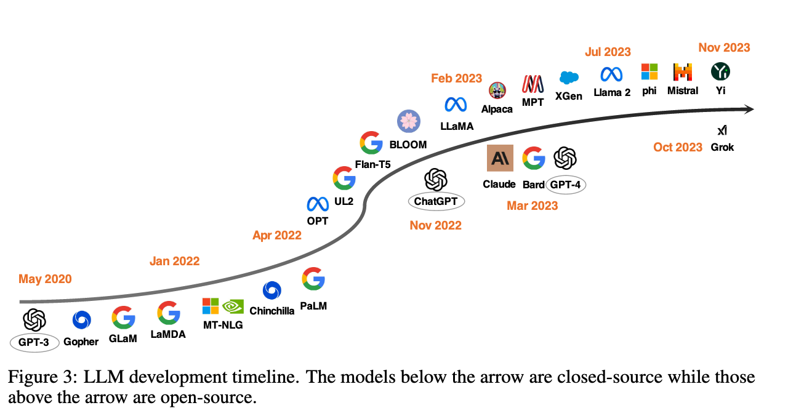
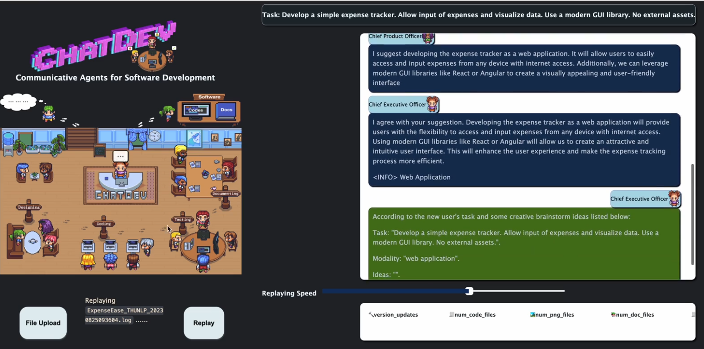
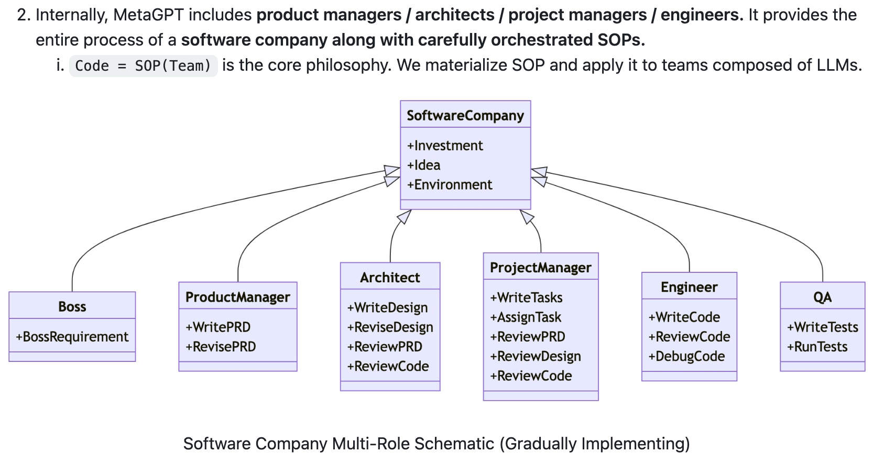
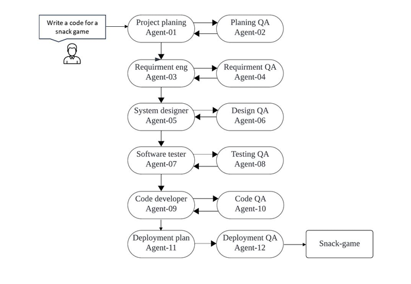

*Source: DALL-E, and the author’s imagination*

### Intro

Welcome to 2024! Change is in the air. Do you feel it? 

Human ingenuity within the world of Generative Artificial Intelligence (Gen AI) has taken us further than we could have ever imagined. These innovations guarantee to upheave the existing software engineering profession as we know it.

New, AI-native companies will rise up and threaten existing businesses. The outcome will be profound. We will witness incredible reductions in lead times from idea to shipped product, massive reduction in operational costs, and therefore radically changed economy and, finally, an ever-decreasing need of reliance in software engineering written by human beings. Yes, I said it. 😱

Many great firms of our time have large technology teams supporting their business processes like Sales, Marketing, Support and so on. How these teams react will determine not only how they maintain their relevance through these changes, but also contribute to a potentially indomitable competitive edge for the firms they enable.

This 2-part article will provide empirical evidence to support the above claims, and shows a possible framework that technology teams can adopt to ride the [Shoggoth](https://en.wikipedia.org/wiki/Shoggoth)

# Why now?

There were three crucial innovations that within the last six months of 2023 which all but guarantee to change the discipline of human-based software engineering 

## Lowering barriers for LLM specialization - The open-source race

Large Language Models (LLMs) are at the heart of what is powering Generative AI, and now, open-source Large Language Models are on the rise and catching up in performance with the current-dominant proprietary winner, GPT4 [1]. 

*Source: Xiong et al. ChatGPT’s One-year Anniversary: Are Open-Source Large Language Models Catching up?*

**Why is this important?** 

To answer this, let’s quickly summarize [2] the two stage process with which LLMs are created:

*Source: Author, inspired by [2] Andrej Karpathy Intro to Large Language Models YouTube video*

As you can see above, stage 1,aka the pre-training of an LLM, is impossible to be done with a shoestring budget, or in someone’s garage. However, companies like Mistral AI, Meta and now even Microsoft (not OpenAI) [3] started putting out high quality open source pre-trained base models like Mistral, and LLAMA respectively which changed the game. All of a sudden, smaller firms and even individuals started creating specialized models and publishing them on [huggingface.co](https://huggingface.co) , the go-to-destination for all open source models. Some really interesting models started to emerge, like Samantha, a pseudo-sentient LLM [4] , and Meditron [5] , a medically astute LLMs.

Of relevance to software engineering, a plethora of coding-specific large language models started to emerge, such as codellama, deepseek coder, phi and many more. Salesforce, the company I work in, also released CodeGen [6]. And, like anything else that catches fire in the Opensource world, these models will get better and better. We shall see LLMs develop bigger and more complex and sophisticated types of software more and more autonomously.

## Here come “Small Language Models”

For any sort of low or no cost development, LLMs need to be able to run on the laptops of the AI Engineer. While LLMs trained with 7B or even 11B parameters can run on reasonably decent laptops, these still take up a bunch of RAM and CPU/GPU. When you have to productionize any always-on capabilities which incorporate these models, you can expect an expensive hosting/cloud bill. Companies like Microsoft started researching [7] how to create base models which are much smaller and still performant and later open sourced small language models, Phi-2 [3]. The primary vehicle was to use **high quality “textbook-level” [8] data,** to train these models instead of the vast swathe of low quality or mixed reliability on the internet. 

Research in this area will continue to accelerate in 2024 as this starts opening the possibility of small models running locally on smaller form-factor electronics like smart phones and even raspberry Pis. Specifically for software development, this will enable a performant and environmentally sustainable option to scale the AI based software engineering, thus lowering another barrier of entry: cost of LLM run-time.

## AI agents collaborating with each other for superior results

If you have used chatGPT, you know that the first answer is sometimes not the best and you have to converse with GPT to tweak and shape the best answer. Well, in the summer of 2023, people started having LLMs chat and critique each other and the results of the output after several iterations was surprisingly much higher quality [9].

This exciting development spawned several open source projects a few of which have caught on like wild-fire. I’d like to give you a little sample of what these multi-agent frameworks (and in some cases, full blown applications) are capable of:

- ChatDev [10]. From their site:

  - Easy-to-use LLM-based framework for [..] collective intelligence.
  - ChatDev is a virtual software company that operates through various intelligent agents including CEO, COO, programmer , reviewer , tester , art designer..

  

*Source: ChatDev [10]*

- MetaGPT [11]

  - *“The Multi-Agent Framework: Given one line Requirement, return PRD, Design, Tasks, Repo”*

    

*Source: MetaGPT [11]*

- Autogen (Microsoft) [12]
  - *AutoGen is a framework that enables the development of LLM applications using multiple agents that can converse with each other to solve tasks.* 
  - Personal note: Autogen has also introduced some pretty interesting agent capabilities like [RAG](https://aws.amazon.com/what-is/retrieval-augmented-generation/), and even a teachable LLM where the agent remembers your chat forever, and you can use a mix of LLMs (closed and open) for different roles

*Source: Autogen (by Microsoft) [12].*

What’s more, there are new multi-agent frameworks still emerging, like crew ai [13] which makes explicit delegation of tasks to specific agents possible. If you go to the discord pages of any of these you will see that people are rapidly adding new capabilities on top of these, and creating documentation and all sorts of integrations. This is a healthy sign of innovation.

## 2H 2023 - Innovation Chronology

Oliver Morris did a fantastic job capturing the specific innovations that took place across Agents, Agent Teams, and LLMs in this graphic below. 

*Reference: [14] Oliver Morris: Can AI Team Up with Itself for Our Benefit?*

## Findings from AI agent collaboration in software development

Independent public [14] and academic [15] research, verified by my own experimentation (I will write more about that in future posts) is showing that multi-agent collaboration yields surprisingly good results given targeted and well thought-through requirements in the prompts and agents with clearly defined roles and scope. 

I have seen AI planners define detailed step by step plans, an AI critiquer helping the planner refine place. Next, the planner hands of the code authoring to the AI programmer, who also has a pair code-reviewer, identifying defects, an executor implementing this code in an controlled environment and sharing the results, and an AI writer even creating technical documentation! Further, there is an option to keep the “human-in-the-loop” if one so wishes. At any step of the way, humans can be introduced to course-correct, be it correcting requirements, changing the user acceptance of the plan, changing the aesthetics of a user interface, or functionality of an API. Human beings start playing at a higher level than software. This is what makes this multi-agent collaboration so flexible, powerful and *fast*

*Source: (research experiment)* *[15] Waseem et al: Autonomous Agents in Software Development: A Vision Paper*

Specifically the researchers have identified the following benefits.

- Enhanced productivity
- Improved code quality
- Scalability & Adaptability
- Streamlined debugging
- Reduced human error

While some of these were obvious like reduced human error and enhanced productivity, the other findings are quite compelling. As the Nvidia CEO so presciently said way back in 2017:

> Software is eating the world, but AI is going to eat software

## Taking a step back

As a software engineering leader, I can clearly see there will be a place for AI based software engineering in every technology firm. And I believe we will start seeing glimpses of this in 2024 with the rise of AI-native companies. 

These two questions emerge.

1. How will this start manifesting in business, and 
2. What does this mean for IT organizations in existing companies

I attempt to address these questions in the following section
