Weel, it took a while but I was able to finally get approval from Marketing, Legal, Security, and PR teams at Salesforce to publish this article. This doesn't talk about Salesforce products,  but shares some best practices on how we have used generative AI to analyze our data to more effectively run operations. I hope that this helps other firms use these tips and tricks to turbo-charge your business analysis as well.

*All diagrams and figures in this article are directional and accurate to convey the concepts, but the data has been anonymized.*

## Insights-in-a-box

- Data Filtering with LLMs: No need to clean data at the source; use an LLM to purify data mid-stream.
- Python Automation with GPT: Intermediate Python skills are typically needed for data extraction, modification, and visualization, but GPT can automate these tasks faster.
- Domain-Specific Ticket Filtering: When metadata is unreliable, filter tickets by the support engineers who worked on them.
- Reliable Data Extraction: Focus on extracting reliable fields like descriptions and timestamps, as these are less prone to errors.
- Data Anonymization with GPT: Use GPT with open-source anonymizer libraries to anonymize data before sending it to public APIs.
- Choosing Delimiters Carefully: Select output delimiters thoughtfully, ensuring they don’t interfere with language model processing, and sanitize input data by removing the chosen delimiter.
- Fine-Tuning GPT for Accuracy: Evaluate and fine-tune GPT’s performance on known ticket descriptions before full analysis.
- Contextual Data Limits: Be aware of GPT’s upper processing limits for contextually unrelated data chunks; stay 10% below the identified limit to avoid data loss.
- Brainstorming KPIs with GPT: After extracting metadata, use GPT to brainstorm and create meaningful KPIs for visualization.
- Streamlined Data Visualization: Utilize GPT to write Python code for creating graphs, keeping analysis streamlined and version-controlled within one environment.

---

## Summary

Have you ever faced off against large volumes of unkempt and free form data entered by human beings and tried to make sense of it? It is an extremely brain-numbing and time consuming job, and unless you have dedicated time to pour over it, chances are that you have ended up just sampling the data, and walked away with surface insights likely using untrustworthy metadata. Typically not great mileage.

It is not hard to see how large language models, which specialize in making sense of chaotic data, can help here. This article walks best practices gleaned from such an implementation, covering a range of concepts such as the most efficient method of using GPT to help you clean the data, do the analysis, and create useful graphs, approaches on managing Personally Identifiable Information (PII), a production-hardened prompt design, working around GPT’s ‘prefrontal cortex’ bottleneck and more!

But before all that, I’ll start with sharing how this experience completely changed my own strongly-held opinion around Data Quality:

I used to believe that in order to improve data quality, you must fix it at the source, i.e. the Systems of Engagement. For example, I used to believe that for a Sales CRM, we must ensure Sales and Marketing teams are entering quality data and metadata in the beginning. Similarly for customer support, we have to ensure the Customer Support Engineers are selecting all the right metadata (ticket cause, sub-cause, etc) associated with the ticket at the inception, duration and closure of the ticket.

After my recent experiences, these beliefs have been smashed to bits. You can absolutely have unruly data at the source, and with the right direction, Large Language Models (LLMs) can still make sense of it resulting in meaningful insights!

***No need to clean data at source: Like a water filter, you just plug an LLM in the middle of the stream and purify it!***

---

## Operating principles

In order to conduct this analysis, I had two simple principles: 

1. Avoid disrupting the team’s current delivery: While it would have been easier for me to request someone in my team to do the analysis, it would have disrupted the team’s velocity. I had to figure out how to do all of the analysis myself, while doing my day job as a product development executive.
2. Use Generative AI for everything: Large Language Models are great in data manipulation and, specifically for this use case, extracting value out of messy data. They are also much better than I am in coding. Finally, it’s easier to tell someone to do things and inspect, than to get in the zone and do the work. This way, you can be deadly even with part-time effort.

## Using GPT to write the analysis code too!

**Bottom-line up front:** *Getting data extracted, modified and visualized requires intermediate level Python coding, but now, GPT can do all that for you much faster, if not with higher quality. Use it!*

In the following picture, I illustrate all the various steps (in Green font) for which code was needed to be written to transform the data and then call the GPT API to extract insights from the ticket details. The best part is that I didn’t have to write this code from scratch. I used GPT to actually write it for me!

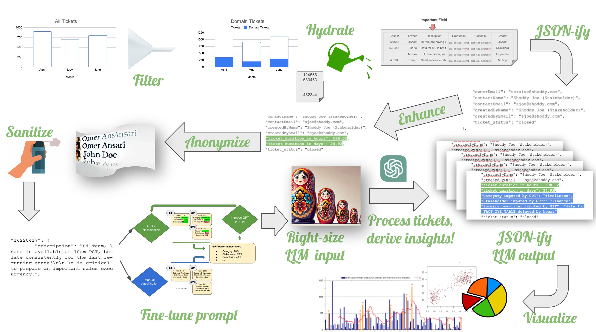

*Figure: All the steps involved for LLM-based ticket analysis*


## How I did the coding

While I am reasonably decent with Python, using GPT to write code makes me atleast 3x a better programmer. I used a very rudimentary method in writing code through GPT: I didn’t use it to execute any code. I just told GPT what the data looked like and asked it to write code for me. I asked GPT to liberally insert print statements to print out variables at different points in the code. Then I copied that code in a Jupyter Notebook and executed it there. For example, my prompt would be something like: 

**Me:** *Here are all the files I will use in my analysis. I'll enumerate them and call them by their number in the prompt.*

*1. "All Interacted Tickets.xlsx"*

*2. "Copy of Ticket Dump - Received from Ops.xlsx"*

*3. "verifying_accurate_list_of_ops_people_supporting_my_space.xlsx"*

*They are all in the ../data/ directory.*

*Write python code to pull in files 1, 2, and 3 into pandas dataframes. Ignore all worksheets in any file which have the word pivot in them but pull in the data for the rest. Name the dataframes in snake case using the text in each of the worksheet itself in each of the excel files….* 

```python
GPT: 
import pandas as pd
import os

# Define the file paths
files = {
1. "All Interacted Tickets.xlsx",
2. "Copy of Ticket Dump - Received from Ops.xlsx",
3. "Verifying_accurate_list_of_ops_people_supporting_my_space.xlsx"
}

def snake_case(s):
    return s.lower().replace(" ", "_")

def read_excel_sheets(file_path, ignore_pivot=True):
    xl = pd.ExcelFile(file_path)
    sheet_names = xl.sheet_names
    ….<code clipped>
```


If there was an error, I would paste the output (including the print statement output) into the *“same”* chat as it preserves memory, and it was ‘mostly’ able to fix my issues. However, in some cases, GPT would get stuck (which you can recognize when it keeps recommending the same solution to an issue), I would start to interrogate it with more questions:

**Me:** *what is df = df[1:] doing*

**GPT:** *The line df = df[1:] is used to drop the first row of the dataframe, which is typically the header row when the Excel file is read….*

**Me:** *df = df[1:] is incorrect, I don't want you to drop the first row. this is in fact the row you want to use for the header of each dataframe.* 

Therefore, if you develop code using GPT out-of-band like I did, a moderate knowledge of Python is useful to break through some code issues with GPT since it is pretty much blind to the context. 

*Note that if you use multi-agent frameworks, history preserving chats, or a combination of the two, there is a chance that the agents would bounce the code off of each other and resolve these defects automatically. In a future post, I will be showing my local environment setup for data engineering and analytics which shows how to set up this multi-agent framework on your laptop. Please let me know in the comments if this would be of interest.*

## Step by Step approach on operational ticket analysis

I came up with the following steps after several iterations and ‘mis-steps’! In other words, if I had to redo this analysis all over again, I would follow the following structure to streamline the process. So, I present this to you so you can reap the benefits.You’re welcome!

### Step 1: Filter out relevant tickets

**Bottomline up front:** *If metadata is unreliable, then filtering tickets related to your domain based on the support engineers who worked them is your best option.*

Reducing the working set of tickets to what is pertinent to just your department or team is an important filtering step that must be taken when you have a significant number of operational tickets being worked on in your firm. You will be sending these tickets through LLMs, and if you’re using a paid service like GPT4, you want to only be sending what is relevant to you! 

However, deducing the working set of tickets is a problem when you have poor metadata. The support engineers may not have been instructed to mark which teams the tickets belonged to, or did not have good ticket categories to select from, so all you have to work with is some free form data and some basic “facts” that automatically got collected for these tickets, like who created the ticket, who owned it, timestamps associated with ticket creation, state change (if you’re lucky) , and ticket closure. There is other “subjective” data that likely exists as well, such as ticket priority. It’s fine to collect it, but these can be inaccurate as ticket creators tend to make everything they open as “urgent” or “high priority”. In my experience deriving the actual priority through LLMs is often more neutral and therefore trust-worthy. Even that can be error-prone though. So, bottom line, stick to the “facts”.

Amongst the fact that typically helps you reduce the working set is the support engineer (who can be an internal employee or through a managed service provider) that created and/or worked the ticket. Since support engineers also specialize in specific domains (data technologies vs CRM vs workday etc) the first step to take is to work with the support managers and identify the names of all the support engineers who work on the tickets associated in your domain.

Then, using an identifiable key which, such as their work email address, you can filter the morass of tickets down to the subset germane to you and pull down the “fact” metadata associated with those tickets.

Completing this step also gives you your first statistic: How many tickets are getting opened for my space over a period of time. 

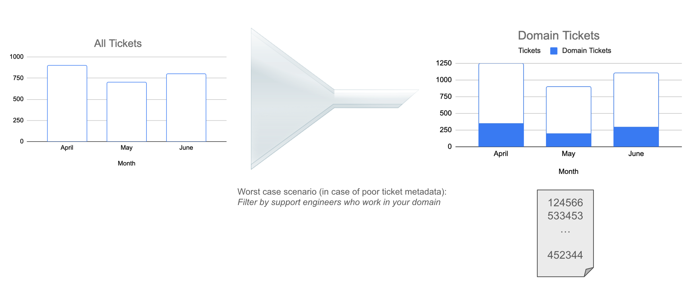

*Figure: Filter out tickets for your organization*

### Step 2: Extracting the “description” field and other metadata

**Bottomline up front:** *While a ticket creator can get much metadata wrong, she can’t afford to mess up the description field because that is the one way she can communicate to the support team her issue and its business impact. And making sense of free flow data is GPT’s specialty. Therefore, extracting the description field and other factual hard to mess up data like ticket start and end time etc.* 

I did some research and most ticketing systems like Jira Service Management, Zendesk, Service Now allow you to download ticket metadata, including the long description field. (I wasn’t as lucky with the homegrown system we use at my work). However, almost all of them have a maximum number of tickets that can be downloaded at one time. A more automated way, and the route I took, was to extract this data using an API. In this case, you need to have the curated set of tickets that were worked on by the support engineers supporting your teams from Step1, and then loop over each ticket, calling the API to pull down its metadata.

Some other systems allow you to issue SQL (or SOQL in case of Salesforce products) queries through an ODBC-like interface which is cool because you can combine step 1 and step 2 together in one go using the WHERE clause. Here’s an example pseudo-code:

SELECT ticket_number, **ticket_description**, ticket_creation_date, blah blah FROM ticket_table 

WHERE ticket_owners include “[johndoe@company.com](mailto:johndoe@company.com), [janedang@company.com](mailto:janedang@company.com)” etc

You get the idea…

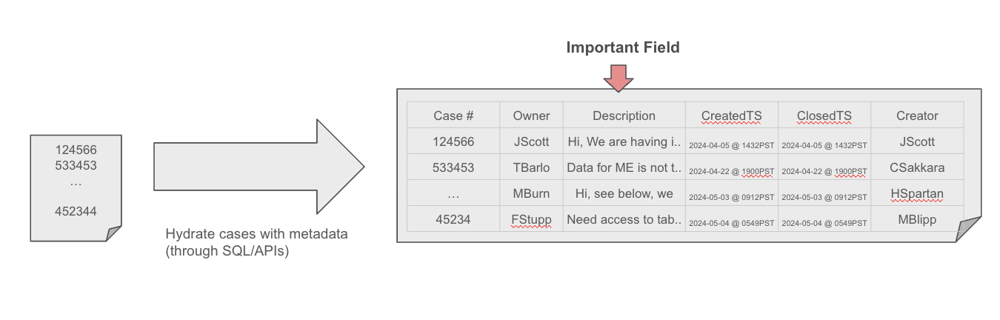

*Figure: Enrich the filtered tickets with metadata, especially the Description field*

Save this data in Excel format and store it on disk.

***Pro-tip:** I like to “serialize” tabular data into an excel format as that removes any issues with escaping or recurring delimiters when pulling this data into Python code. The Excel format encodes each data point into its own “cell” and there are no parsing errors and no column misalignment due to special characters / delimiters buried inside text. Further, when pulling this data into Python, Pandas (a popular tabular data manipulation library) has a simple excel import option which pulls the Excel data into a Pandas dataframe*

### Step 3: Converting data into a GPT-friendly format (JSON)

**Bottom-line up front:** *JSON is human readable, machine readable, error-safe, easily troubleshot, and happens to be a great representation of the data structure in a GPT prompt. Further, as you enrich your data you can keep hydrating the same JSON structure with new fields.*

After some hit and trial iterations, I realized the most efficient way for GPT to write data processing code for me was to convert my data into a json format and share this format with GPT to operate on. There is nothing wrong with shoving this data into a pandas dataframe, and it may even be easier to do that step to efficiently process, clean and transform this data. The big reason why I have landed on eventually converting the final data set into JSON is because sending tabular data into a GPT prompt is kludgy. It is hard to read both for you and also can introduce errors for the LLM. Here’s some reasons I’ve experienced: When you’re introducing tables into a prompt, it has to be done through a comma-separated-value (csv) format. There are two problems with that 

1. Since there can be commas inside the text as well, you have to further escape those commas, by putting the text inside double quotes (for example, “text one”, “text, two”, “test \“hi!\”” . That introduces another problem: 
2. what if you have double quotes (“) inside that text block. Now you have to further escape those double quotes. Matching separating these values into separate columns invariably brings issues. 

And yes, while you have to escape double within JSON too (eg “key”: “value has \”quotes\””) , there are absolutely no issues in aligning this value to a column since the “key” uniquely identifies that. The column alignment can go off in some edge cases in a csv format, and then it becomes very hard to troubleshoot what went wrong.

Another reason for using JSON is that you can cleanly see and differentiate when you augment your metadata through GPT in future steps; it just adds more key value values horizontally down. You could do that in a table too, but that mostly requires a scroll towards the right in your IDE or notebook. 

***Pro-tip:** In a future step, you will be sending this data into GPT, and will ask it to return multiple fields separated by a delimiter, such as “|”. Therefore, this is a good time to remove any occurrence of this delimiter from the free-form field that you are passing into the JSON format.*

```json
"16220417": {
        "description": "Hi Team, \nThe FACT_XYZ_TABLE has not refreshed in time. Typically the data is available at 10am PST, but when I see the job, it has been completing several hours late consistently for the last few weeks. Also, it is 11am, and I see that it is still in running state!\n\n It is critical that this table is completed in time, so we have enough time to prepare an important sales executive report by 8am every morning. Please treat this with urgency.",
        "opened_priority": "P2 - Urgent",
        "origin": "Helpdesk ticket portal",
        "closedDate": "2024-02-26T07:04:54.000Z",
        "createdDate": "2024-02-01T09:03:43.000Z",
        "ownerName": "Tom Cruise (Support Engineer)",
        "ownerEmail": "tcruise@shoddy.com",
        "contactName": "Shoddy Joe (Stakeholder)",
        "contactEmail": "sjoe@shoddy.com",
        "createdByName": "Shoddy Joe (Stakeholder)",
        "createdByEmail": "sjoe@shoddy.com",
        "ticket_status": "closed"
    },
```

*Figure : Sample JSONified ticket metadata with ticket number as key, pointing to an object containing further key/value metadata. There would be lots of these types of JSON blocks, one for each ticket.*

### Step 4: Enhancing data using simple techniques (aka Basic Feature Engineering)

**Bottom-line up front:** *Simple mathematical analysis like, time deltas, averages, standard deviations can easily, and more cheaply, be done using basic coding, so get GPT to write code for that, instead of sending GPT the data to do the math for you. Language models have been shown to make mathematical mistakes, so best to use them only for what they’re good for.*

First, we can enhance the ticket metadata by aggregating some of the basic information in it. This is a pre-step which is better done with some simple code instead of burning GPT credits for it.

In this case, we calculate the ticket duration by subtracting CreatedTime from ClosedTime.

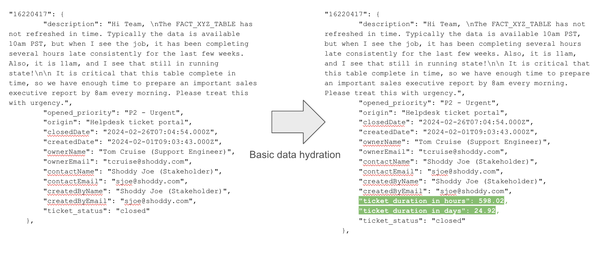

*Figure : left to right a JSON showing as getting hydrated through basic data aggregation/enhancement*

### Step 6: *The Main Entree: GPT-driven data enhancement (enhanced Feature Engineering)*

Now we come to the main entree. How to use GPT to transform raw data and derive sophisticated and structured metadata from which insights can be extracted. In the world of data science, this step is called Feature Engineering.

#### 6.1: Pre-processing: Obfuscate sensitive information (optional)

**Bottomline up front:** *Get GPT to use open source anonymizer libraries and develop code to anonymize the data before you send it to a public API service.*

This step applies to you in case you are using openAI and not a local open source LLM where the data stays on your laptop. In a future post, I will be showing my local environment setup for data engineering and analytics which shows an open-source LLM option.

In the firm I work in, we have a safe proxy gateway to openAI which masks Privately Identifiable Information (PII) and operates the Open AI within a Trusted boundary. This is convenient because I can send all internal information to this proxy and enjoy the benefits of openAI cutting models in a safe way.

However, I realize not all companies are going to have this luxury. Therefore, I’m adding an optional step here to obfuscate personally identifiable information (PII) or other sensitive data. The beautiful part of all this is that GPT knows about these libraries and can be used to write the code which obfuscates the data.

I evaluated five libraries for this purpose, but the critical feature I was looking for was the ability to convert sensitive information to anonymous data, and then be able to re-convert it back as well. I found only the following libraries which have this capability.

- Microsoft Presidio [[link](https://github.com/microsoft/presidio)] (uses the concept of entity mappings)
- Gretel synthetics [[link](https://github.com/gretelai/gretel-synthetics)] (uses the concept of “Tokenizer)

Out of these two, presidio was my favorite. I continue to be impressed to see the amount of “high quality” open source contributions Microsoft has made over the last decade. This set of python libraries is no different. It has the capabilities of identifying PII type data out of the box, and to customize and specify other data which needs to be anonymized. I would recommend you look at this [notebook](https://github.com/microsoft/presidio/blob/main/docs/samples/python/pseudonomyzation.ipynb), which maintains a mapping of the items anonymized so that you can de-anonymize them when the data is returned. Here’s an example:

original text:

```
('Peter gave his book to Heidi which later gave it to Nicole. Peter lives in London and Nicole lives in Tashkent.')
```

Anonymized test:

```
`<PERSON_1> gave his book to <PERSON_2> which later gave it to <PERSON_0>. <PERSON_1> lives in <LOCATION_1> and <PERSON_0> lives in <LOCATION_0>.`
```

This can be sent to GPT for analysis.

*Entity mappings*

```
{ 'LOCATION': {'London': '<LOCATION_1>', 'Tashkent': '<LOCATION_0>'},
 'PERSON': { 'Heidi': '<PERSON_2>',
 'Nicole': '<PERSON_0>',
 'Peter': '<PERSON_1>'}}
```

Using Entity mappings the text can be de-anonymized:

*de-anonymized text:*

```
('Peter gave his book to Heidi which later gave it to Nicole. Peter lives in London and Nicole lives in Tashkent.')
```

Note that apart from PII, other information that may need to be obfuscated is systems information (IP addresses, DNS names etc) and database details like (names, schemas etc)

Now that we have a mechanism to anonymize sensitive data, the next step was to create a high quality prompt to run on this data.


#### 6.2 Pre-processing: Sanitize the input data

**Bottomline up front:** *Be thoughtful in choosing an output delimiter, as certain special characters hold “meaning” in language models. Then, you can feel secure in sanitizing the raw input by removing the delimiter you chose.*

**Problem:** When asking a text based interface, like an LLM, to return tabular data, you have to tell it to output the data separated by delimiters (e.g. csv, or tsv format). Suppose you ask GPT to output the summarized data (aka “features”) in comma separated values. The challenge is that the input ticket data is raw and unpredictable, and someone could have used commas in their description. This technically should not have been a problem since GPT would have transformed this data and thrown out the commas coming into it, but there was still a risk that GPT could use part of the raw data (which included commas) in its output, say in the one-liner summary. The experienced data engineering folks have probably caught on to the problem by now. When your data values themselves contain the delimiter that is supposed to separate them, you can have all sorts of processing issues.

Some may ask: Why don’t you escape all these by encapsulating the value in double quotes. E.g.

*“key” : “this, is the value, with all these characters !#@$| escaped” .* 

Here's the issue with that. The user could have input double quotes in their data too!

 *“key” : “this is a ”value” with double quotes, and it is a problem!”*

Yes, there are ways in solving this issue too, like using multiline regular expressions, but they make your code complicated, and make it harder for GPT to fix defects. So the easiest way to handle this was to choose an output delimiter, which would have the least impact in losing data context if scrubbed from the input, and then scrub it out of the input data!

I also played around with delimiters that would sure shot not be in the input data like |%|, but I quickly realized that these ate up the output token limits fast, so this was out.

Here are a few delimiters I tested

| **Delimiter considered for cutting the output data** | **Risk of GPT losing context if removed from input** | **Token cost** |
| ---------------------------------------------------- | ---------------------------------------------------- | -------------- |
| , (comma)                                            | high                                                 | low            |
| <tab>                                                | high                                                 | low            |
| % (percent)                                          | high                                                 | low            |
| \| (pipe)                                            | low                                                  | low            |
| \|%\|                                                | none                                                 | high           |

In the end, I ended up selecting the pipe “|” delimiter as this is not something most stakeholders used when expressing their issues in the ticket description.

After this, I got GPT to write some extra code to sanitize each ticket’s description by removing “|” from the text.


#### 6.3 - Prompt Performance tuning

**Bottomline up front:** *Before running the GPT data analysis prompt, evaluate its performance against a set of ticket descriptions with known output, fine tune the prompt and iterate until you are getting the maximum performance scores*

**Goal:** To have GPT read the ticket description written by the customer and just from that, derive the following metadata which can then be aggregated and visualized later: 

1. Descriptive title summarizing the issue
2. Business Impact*
3. Ticket Severity*
4. Ticket Complexity 
5. Impacted stakeholder group
6. Owning team
7. Ticket category

** based on impact and urgency if provided by customer*

**Approach:** The way I worked on sharpening the main prompt was to 

1. sample a few control tickets, 
2. manually classify each of them the same way I wanted GPT to do them (by Category, Complexity, Stakeholder (Customer) group etc), 
3. run these control tickets through a designed prompt GPT, 
4. Cross-compare GPT results against my own manual classification, and 
5. score the performance of GPT’s classification against each dimension
6. Improve the GPT prompt based on whichever dimension scored lower in order to improve it

See below illustration:

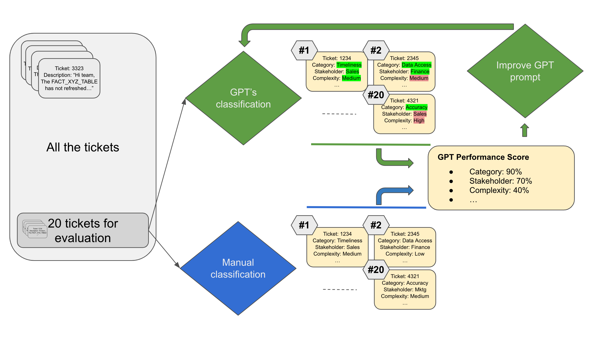

This gave me important feedback which helped me sharpen my GPT prompt to get better and better scores against each dimension. For the final prompt, check out [Appendix: The GPT prompt to process ticket descriptions](https://docs.google.com/document/d/1-GEMcOa0OF3-rLsVP6F1ZgVfMYcEjsltmbGIIjxbEC4/edit#heading=h.4k28p1gr2x2r).

**Results:** 

Here are the details around this metadata derived from raw ticket description, and the overall performance scores after multiple iterations of fine-tuning the prompt:

| **Metadata derived by GPT** | **Details**                                                  | **# of iterations of fine-tuning the prompt** | **GPT’s final performance accuracy** |
| --------------------------- | ------------------------------------------------------------ | --------------------------------------------- | ------------------------------------ |
| Title                       | Descriptive title under 255 characters                       | 1                                             | 90%                                  |
| Business Impact             | Impact in one-line if provided by cust. Leave as N/A if not provided, don’t invent one. | 1                                             | 90%                                  |
| Ticket severity             | Identify the true severity (S1, S2, S3 or S4) of the issue based on clear criteria related to business impact | 5                                             | 40%                                  |
| Ticket complexity           | Ticket complexity (High, Medium or Low) based on GPT’s knowledge of the Data domain. | 5                                             | 40%                                  |
| Impacted Stakeholder Group  | Which internal customer group was impacted (e.g. Finance, Sales, Marketing, HR etc) | 3                                             | 70%                                  |
| Owning team                 | Which team owns the issue (Data Engg, Data Platform etc) based on GPTs knowledge of the Data domain. | 4                                             | 90%                                  |
| Ticket Category             | What is the ticket category based on DAMA Data Quality Framework (examples: Completeness, Uniqueness, Timeliness, Accuracy), also included Data and Systems access ticket types | 2                                             | 90%                                  |

Here’s my rationale on why certain dimensions scored low despite multiple turns:

- **Complexity:** I did run into a challenge when scoring “Complexity” for each ticket, where GPT scored the complexity of a ticket much higher than it was, based on its description. When I told it to score more aggressively, the pendulum swung the other direction, and, like a dog trying to please its owner, it started to score complexity much lower, so it was unreliable. I suspect the out-of-the-box behavior of scoring complexity higher than it is supposed to be is because of the current state of the art GPT capabilities. I used GPT4, which is considered to be a smart high school student, so naturally a highschool student would score this complexity higher. I suspect that future versions of these frontier models would bring college level and then phD level abilities, and we would be able to more accurately measure the complexity of such tasks. Alternatively, to improve even GPT4 complexity scoring analysis, I could have used the “few-shot” learning technique here to give some examples of complexity which may have improved the performance score for this dimension.
- **Severity:** While I asked GPT to use the impact vs urgency matrix to score severity, GPT had to rely on whatever the stakeholder had provided in the ticket description, which could be misleading. We are all guilty of using words designed to provoke faster action, when we open internal tickets with IT. Further, the stakeholder didn’t even provide any impact detail in the ticket description in a non-trivial amount of cases, which lead GPT to select an erroneous severity as well.

Despite some metadata dimensions scoring low, I was pleased with the overall output. GPT was scoring high in some critical metadata like title, and category, and I could run with that. 

The prompt was in good shape, but I was about to run into an interesting GPT limitation, its “forgetfulness”.

#### 6.4 - Figuring out the limits of GPTs forgetfulness

**Bottomline up front:** *When sending in contextually* **unrelated** *chunks of data (such as many ticket descriptions) into a GPT prompt, the upper processing limit can be much less than what you get by stuffing the maximum chunks allowed by input token limit. (In my case this upper limit ranged between 20 to 30). GPT was observed to consistently forget or ignore processing beyond this limit. Identify this through hit and trial, stick to a number 10% below that limit to avoid data loss.* 

Humans can keep 5-7 unrelated things in our prefrontal cortex, and it turns out GPT can keep 30-40 unrelated things, no matter how big its context window. I was only really sending the ticket number and description. The rest of the data did not require any fancy inference.

Since I had almost 3000 tickets for GPT to review, my original inclination was to try to maximize my round trip runs and “pack” as many case descriptions I could into each prompt. I came up with an elaborate methodology to identify average token size based on the number of words (as token is a sub-word, in the transformer architecture), and saw that I could fit around 130 case descriptions in each prompt.

But then I started seeing a weird phenomena. No matter how many ticket descriptions I sent into GPT to process, it consistently only processed just the first 30 tickets! GPT appeared to not have the capacity to handle more than this magic number.

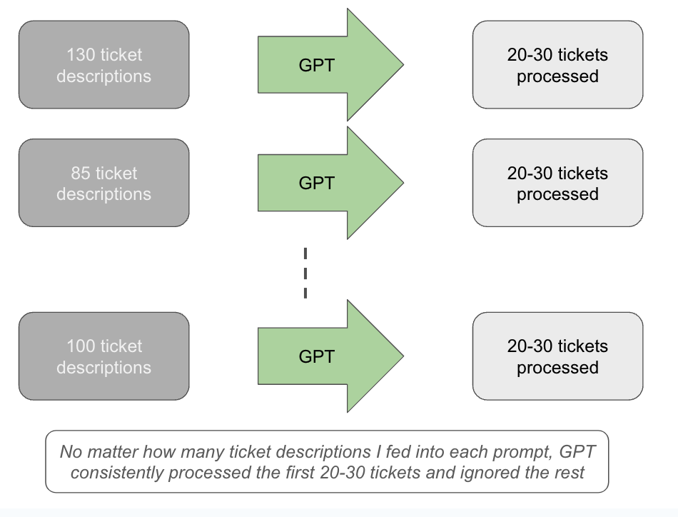

This made me change my strategy and I decided to decrease the ticket batch size to maximum 10-12 for each API call, based on the word count for that chunk. While this approach certainly increases the number of calls, and therefore prolonged the time for the analysis, it ensured that no tickets got dropped for processing.

```
*Total tickets chunked: 3012*

*The full ticket data has been chunked into 309 chunks:*
*Chunk 0: Number of words = 674*
*Chunk 0: Number of tickets = 12*
*Chunk 1: Number of words = 661*
*Chunk 1: Number of tickets = 12*
*Chunk 2: Number of words = 652*
*Chunk 2: Number of tickets = 12*
*Chunk 3: Number of words = 638*
*Chunk 3: Number of tickets = 7*
*Chunk 4: Number of words = 654*
*….*
```

When reviewing this with an AI architect in my firm, he did mention that this is a recently observed phenomena in GPT. The large input contexts only work well when you have contextually related data being fed in. It does break down when you are feeding disparate chunks of information into GPT and asking it to process completely unrelated pieces of data in one go. This is exactly what I observed.

With an optimal ticket batch size of 10-12 tickets identified and a performant prompt created, it was time to run all the batches through the prompt..

#### 6.5 Show time! Running all the tickets through GPT

**Bottomline up front:** *GPT can analyze tickets in hours when the same amount can take weeks by humans. Also it's extraordinarily cheaper, though there is an error rate associated with GPT.*

I provided GPT with the JSON format to write me code which did the following: 

- load the JSON data into a dictionary
- Iterate 15 tickets at a time, concatenating the GPT analysis prompt with these 15 tickets into the FULL GPT prompt, separating each ticket/description tuple by ###
- Sending the full prompt to the GPT API (For work, I called a safer internal wrapper of this same API that my firm has built, which has security and privacy embedded into it, but by using the obfuscator step earlier, you can just as safely use the external GPT API.)
- Save the output, which came out as a pipe-separated format by concatenating that into a file on disk.
- Running the de-anonymizer, if obfuscation was done in this step: [6.1: Pre-processing: Obfuscate sensitive information (optional)](https://docs.google.com/document/d/1-GEMcOa0OF3-rLsVP6F1ZgVfMYcEjsltmbGIIjxbEC4/edit#heading=h.9u8jssdw16lj)
- Saving the de-anonymized output into the original JSON file as well.
- Save the JSON file on disk after the full run is completed*.
- Print some visible queues on how many tickets had been processed
- Time some states for each API call around text processed, number of tickets, start and end time.

*** Why saving to disk after a good run is pragmatic:** *These are costly runs, from a time perspective more than a money perspective. So after a successful run is completed, it is wise to serialize (save) this data on this disk, so that future analysis can be run on saved data and this code block in the Jupyter notebook doesn’t have to be repeated. In fact, after a successful run, I commented out the whole code block within my notebook, so that if I ran the full notebook start to finish, it would just skip this expensive step again and instead load the JSON data from disk into memory and continue on with the analysis.*

Here’s a sample output of the fully hydrated JSON. The blue entries were metadata that GPT extracted from the description field

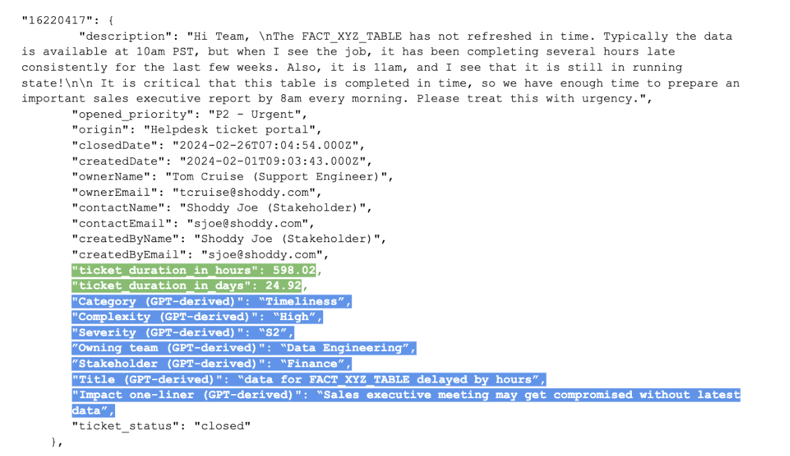

I ran about 3000 tickets through this cycle, and it completed in about 2.95 hours. 👏

Just to give you a comparison point on how long this would have taken if I had employed human beings for this work: I had a similar experience to draw from 2 years ago; I had inherited an Operations team and there was poor metadata. I had to sanction 2 of my senior engineers full time for a month to laboriously and meticulously go through 1500 ticket descriptions and classify them. Contrast this with GPT. Despite the smaller batch size of 15 tickets per API call, GPT did 2800 tickets in 2.95 hours! Yes, while there was an error rate of 10% with GPT, it still analyzed more tickets in 3 hours than 2 human beings did in 1 month.

So the time savings is clearly insane, but what about the cost comparison?

#### GPT4 vs human analysis cost comparison

I asked GPT to help me with the cost comparison:

**Prompt:** how much does gpt4 cost if I use its API for 2.95 hours, compared to 2 senior IT software engineers one based out of the midwest and another working from India, working full time on the same project for 2 months (excluding weekends)

**Salary Estimates:**

1. Midwest (USA) Senior IT Software Engineer:
   - Average annual salary: $120,000 (this can vary depending on the exact location and company, but it’s typically lower than Silicon Valley).
   - Monthly salary: $120,000 / 12 = $10,000.
2. Hyderabad, India Senior IT Software Engineer:
   - Average annual salary: $30,000 (this can vary, but it’s generally much lower than in the USA).
   - Monthly salary: $30,000 / 12 = $2,500.

**Cost Calculation for 1 Month:**

- Midwest Engineer:
  - 2 months salary: $10,000 * 1 = $10,000.
- Hyderabad Engineer:
  - 2 months salary: $2,500 * 1 = $2,500.
- Total cost for both engineers: $12,500

**GPT-4 API cost for 2.95 hours**: ~$6.64 (assuming GPT-4-8k pricing and the given token usage rate).

**Summary:**

- The cost of employing one software engineer from the Midwest and one from Hyderabad for one month would be approximately $12,500.
- Using GPT-4 for 2.95 hours would cost approximately $6.64, which is significantly lower.

Even if you added in the cost of the 20 hours I worked on this project over 7 days, the overall cost comparison still comes out much better. And what’s more, this work is now reproducible.

***In about $7 and 3 hours, GPT did the same analysis humans would have taken 1 month and cost $12,500 to complete***

🎤 Mic drop.


#### Step 7 : Extracting insights from the GPT-derived metadata

**Bottomline up front:** *Once you have extracted useful metadata using GPT, turn around and brainstorm with GPT what kind of KPIs you can graph out of it. It only raises your game.*

While there were already things I was curious to find out, I also brainstormed with GPT to give me more ideas. Again, using a JSON format was very handy, I just passed an anonymized sample for one ticket to GPT and asked it, *”Based on what you see over here, give me some ideas on what type of graphs I can plot to derive insights around my operations”*

In the end here are the ideas that we both came up with.

| **Idea**                                     | **Source** | **Worth Considering?**                                       |
| -------------------------------------------- | ---------- | ------------------------------------------------------------ |
| Ticket Priority Distribution                 | GPT        | No. Priority of “service requests” set by internal stakeholders is irrelevant, and the priority set by GPT wasn’t that accurate. |
| Ticket Status Count Over Time                | GPT        | Yes. I hadn’t thought of this, and this would tell me if the ticket backlog was reducing or increasing, a sign of if my operations personnel capacity is sized appropriately. |
| Average Ticket Duration by Priority          | GPT        | No. Even if there’s any correlation between duration and priority it really doesn’t provide value. |
| Ticket Count by Ticket Owner                 | Me / GPT   | Yes, Already implemented. Good idea about top and bottom ticket-taker trends |
| Same-day ticket Count by Ticket Owner        | Me         | Same day tickets are tickets that open and close the same day. These are ripe for automation or self serve. Useful to see if some folks more than others are taking these bumping their ticket counts up? |
| Same-day ticket as % of total tickets        | Me         | What is the uplift I can get if I work on making these quick tickets self-serve or automate the process. |
| Ticket Count by Category                     | Me / GPT   | Yes, Already implemented. Useful for identifying top areas like Data Accuracy, Data Timeliness |
| Ticket Count by Category cut by Owning team  | Me         | Are there any dominant categories (e.g. Data Access) hitting certain teams (e.g. Data Platform team), and what’s the spread and volume of these categories across teams |
| Ticket count by stakeholders                 | Me / GPT   | Yes, already implemented. Which stakeholders are the most demanding. This can also help in the future for chargeback purposes. |
| Ticket count by stakeholders cut by category | Me         | Useful to see if some stakeholders like Finance tend to open a certain category of tickets (e.g. if they have , say , more Issues with Data Timeliness than other LOBs) |
| Monthly ticket trends                        | GPT        | No. I only had a few months of data for this analysis. Could be useful if the time horizon was longer |
| Ticket Duration Histogram                    | Me / GPT   | Yes, already implemented. This was helpful in identifying that the majority of my tickets resolved under 5 days, but there was a long tail of more aged tickets, that could be correlated with ops ticket owners (e.g. an ops engineer not practiing good ticket hygiene of follow up etc) |
| Descriptive title frequency                  | GPT        | Yes, I hadn’t thought of using GPT for a 2nd pass on the titles and see if there were specific issues (not just the general trends) that were repeating. The descriptive titles tended to have similar text which makes this worth exploring. |


#### Step 8 : The visualization

**Bottomline up front:** *Thanks to GPT you can write Python code to create graphs, instead of transforming data in Python and moving this data out to a visualization tool. This helps keep all your analysis streamlined, faster, version-controlled, self contained in one place.*

Historically, a typical pattern in Exploratory data analysis (EDA) is to extract, and transform the data in Python and then store it in a file or a database and then connect Tableau, Power BI , or Looker to this data to create graphs using it. While having long-living dashboards in these visualization products is absolutely the way to go, doing early-stage EDA this way is a high friction process which introduces delays. It also becomes hard to manage and match different versions of the graphs with the different versions of the data transformations done. However, it was a necessary evil for two reasons:

1. (Pull) These visualization tools are intuitive and have a drag and drop interface, meaning you can experiment and create graphs very fast. 
2. (Push) The de facto Python library for generating graphs is matplotlib. I don’t know about you, but I find matplotlib a very user-unfriendly library(unlike R’s ggplot library which is a joy to use).

However, now that GPT can write all the matplotlib code for you, there is less of a need to move your work to a visualization tool at the end. You can stay within the same Python Notebook from start to finish, and that's exactly what I did!

I did check Tableau to verify if some of the moderately complex aggregation logic was correctly being computed in Python (and in fact this helped me find a bug) but by and large, all the graphics I needed were built using scatter, bar , line , histogram and pie plots using Python’s matplotlib.

Here are some examples of these graphs and tables. The text and numbers are of course anonymized but the intent here is to show you the kind of insights you can start extracting.

***The goal for any insight is to drive deeper questions and eventually take meaningful action grounded in data, which eventually results in creating value.***

The insight is what gets you curious about why the system is behaving the way it is, so you can attempt to improve it. 

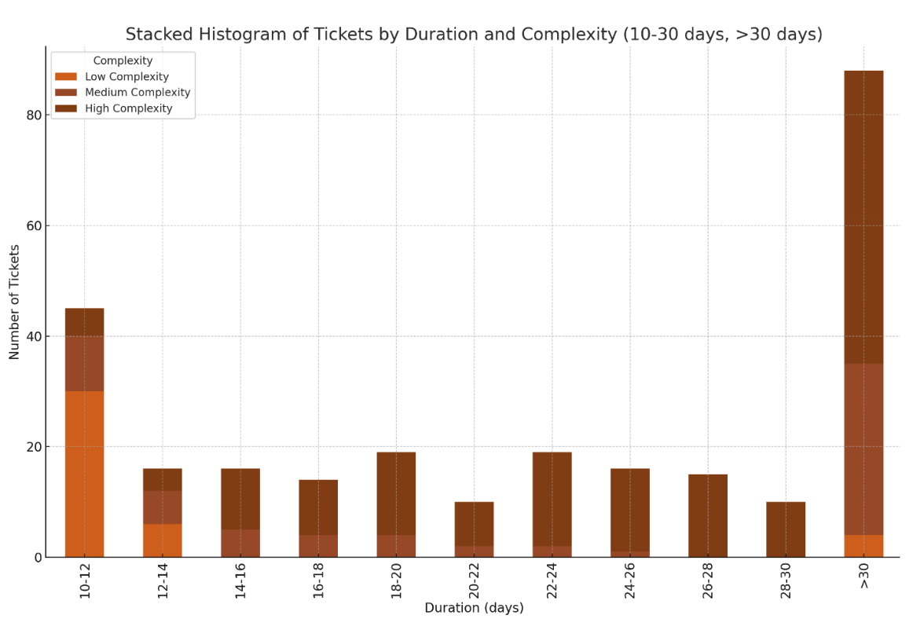

How do the complexity of tickets exactly contribute to the time duration of that ticket and which groups of tickets to focus on to reduce their time duration and improve customer satisfaction.

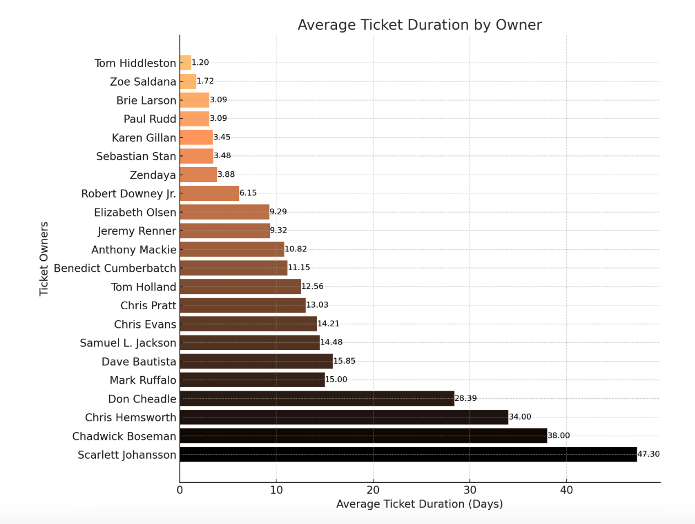

Identify If there is a relation with ticket duration and the support engineer working on it, so you can suss out behavioral or training issues

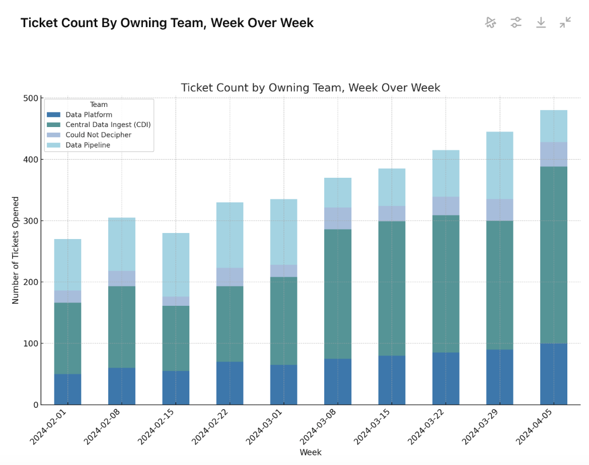

Which engineering team receives the largest number of tickets and how is that trend progressing. Working on service requests (pure operations work) is a hidden cost to quantify since it needs to be deducted from an engineering team's sprint velocity. In absence of this data, engineering teams typically allocate a % of their time to operations work, which we all know is blunt and varies from team to team. With this type of analysis you can more accurately carve capacity for such operations work while not compromising the team's product commitments or burning the individuals out.

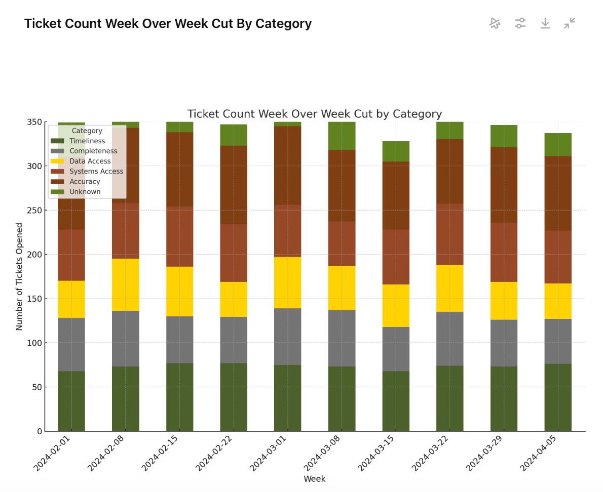

What are the trends of these tickets by category? Do we see more timeliness issues vs accuracy problems? How many of these tickets

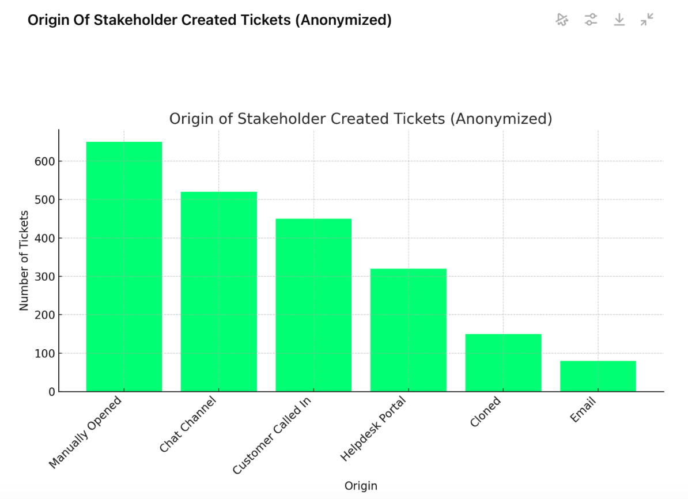

Which interfaces do our customers use to open the tickets the most so we can streamline and optimize those areas, perhaps inserting helpful articles for self-service.

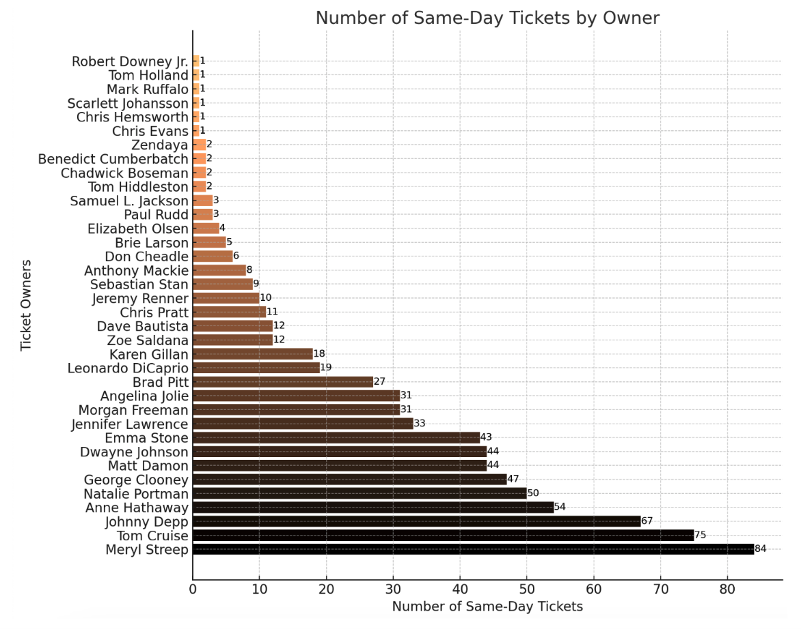

How many tickets are 1 day old, and are there any patterns in the ops personnel where some are cherry picking a lot of these simple cases than others. This can help with balancing resource management.

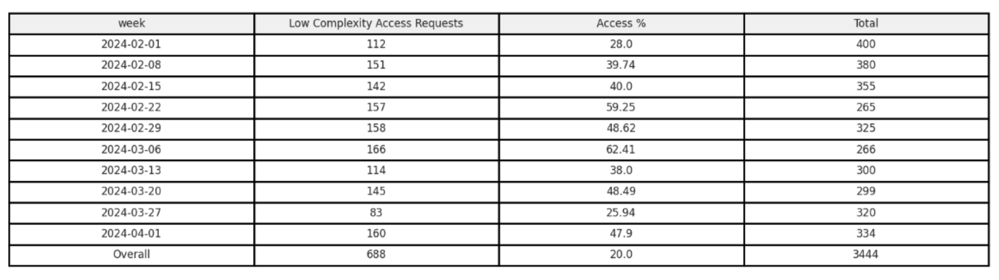

How many tickets were truly low complexity issues such as data access or systems access, things for which automations and self-serve options can be put in place.

### Future enhancements

- This analysis, however very insightful, was just at a surface level just visualizing the data . There can be more sophisticated work that can be done by using linear or logistic regression, ANOVA for predictive analysis, or using clustering methods (like KNN) to tease out other patterns in the data.
- Multi-agent framework (MAF) benefits:
  - I had to do a lot of rounds back and forth with GPT to write the actual code (See [Using GPT to write the code to use GPT for data analysis!](https://docs.google.com/document/d/1-GEMcOa0OF3-rLsVP6F1ZgVfMYcEjsltmbGIIjxbEC4/edit#heading=h.sc54nlic7zii)) While it was still significantly faster (7 days part time) than what would have taken me writing this from scratch (30 days full time!), I do think using AI agents (backed by LLMs) which can critique each other’s output and come up with better ways. 
  - GPT was really blind when it came to recommending code. I copied code from it and ran it locally in my jupyter notebook. A better way would have been to have a MAF setup with an environment agent (perhaps powered by a [container](https://microsoft.github.io/autogen/docs/tutorial/code-executors) perfectly set up with my required libraries etc), and then the AI coder agent write the code, execute it , find defects, iterate and fix it. I imagine that would have shaved over 50% of my development time.
  - Breaking the analysis prompt up: While I ended up using the one mega prompt to run the analysis, if I were using some chained AI agent mechanism, I could have broken the analytics tasks out to different agents, powered them with different LLM endpoints, with different [temperature](https://www.hopsworks.ai/dictionary/llm-temperature#:~:text=The LLM temperature serves as,exploration%2C fostering diversity and innovation.) settings each. The lower the temperature the more precise and less creative the LLM is. For example, I learnt the hard way that with the default temperature setting, GPT ended up making minor changes to the categories for each ticket (like “Data Completeness” or “completeness”) which just ended up creating more post-processing clean-up annoying work for me.
  - Heck, I could have even gotten large chunks of this very document written for me by a creative AI agent in my multi-agent team!

### Closing thoughts

Our customers experience our products through how they interact with them day to day. Through tickets, service requests they are constantly sending us signals on what’s working and what’s not working, forming an impression about us by seeing how receptive we are to these signals. Oftentimes though, we are fixated on product development, major transformational programs underway, tracking and monitoring the next flashy thing being built in the kitchen and ignore these operational signals at our peril. Sure, being responsive to major incidents is the job of every accountable leader, and good things emerge by working on action plans that come out through those Root Cause Analysis (RCA) calls. However, I would argue that there is a large quantity of moderate severity issues, and service requests that our customers are opening which often goes ignored just because of its sheer volume. And when, in earnest, you open this treasure trove of ticket data, it is often so overwhelming and uncurated that your head starts spinning! You risk walking away with a simplistic and incomplete mental model based on summary reports created by someone else. 

My philosophy is that, as a leader, you must create the time and capabilities to dig your fingers in the dirt. That is the only way you get a true feel of how your business operates. While this article attempts to give you some of the capabilities to jump start your journey into operational tickets, only you, my dear reader, can create the time and space to act on them. What’s more, I’m hopeful that some of the insights you’ve learnt in effectively using LLMs to turbocharge your analysis will be transferable in many other areas beyond operational ticket analysis.

### Appendix: A fine-tuned version of the GPT prompt

This is a scrubbed out version of the latest prompt I used to conduct the ticket analysis.

Below are examples of cases along with their descriptions, each separated by ###. These are related to data-related technologies. Your task is to carefully review each case, extract the necessary 7 data points, and present the results in the specified format. Detailed instructions are as follows:

1. **Title:** For each case, create a concise and descriptive title based on the content of the description, ensuring it is 300 characters or less.
2. **Impact:** From the description, summarize the impact in a brief one-liner. If the impact isn't directly stated or implied, simply write "Impact Not Provided."
3. **Severity:** Assign a severity level to each case using an urgency vs impact matrix approach, considering both the urgency of the issue and its impact on the system:
   - **S1:** High urgency and high impact, possibly causing system outages or making the application unusable.
   - **S2:** High urgency but with a moderate impact or moderate urgency with a high impact, affecting multiple users.
   - **S3:** Low urgency with a moderate or low impact, with minimal user disruption.
   - **S4:** Low urgency and low impact, often related to general requests (Note: Access issues are not generally S4).
   - Only one severity level should be assigned per case.
4. **Complexity:** Assess the complexity of the case based on your expertise in the data field:
   - **High Complexity**
   - **Medium Complexity**
   - **Low Complexity**
   - Typically, access-related cases are low complexity, but use your judgment based on the description.
5. **Line of Business (LOB):** Determine the relevant line of business based on the description. The options are:
   - **Finance**
   - **Marketing**
   - **Sales**
   - **Customer Support**
   - **HR**
   - **Miscellaneous:** If you can't clearly identify the LOB.
   - Choose only one LOB per case. If multiple are mentioned, pick the most prominent.
6. **Team:** Assign the appropriate team based on the description. The options are:
   - **CDI (Central Data Ingest):** Any case mentioning CDI or "Central Data Ingest team" should be classified under this team exclusively.
   - **Data Engineering:** Cases related to data pipelines, such as extraction, transformation, or loading.
   - **Data Platform:** Any issues related to data platforms, including data visualization or DEP.
   - Only one team should be assigned per case.
7. **Ticket Category:** Finally, categorize the ticket based on the description, using a simple 1-2 word label. Use the DAMA data quality dimensions for this classification. The categories should include, but aren't limited to:
   - **Completeness:** Ensuring all necessary data is included.
   - **Uniqueness:** Verifying data entries are unique and not duplicated.
   - **Timeliness:** Ensuring data is up-to-date and available as expected.
   - **Accuracy:** Confirming data is correct and conforms to its true values.
   - **Consistency:** Ensuring data is uniform across different datasets.
   - **Validity:** Ensuring data adheres to required formats or values.
   - **Access:** Related to requests for accessing data or systems.
   - You may create 2-3 other categories if needed, but keep them concise and consistent.

Here is an example of the output format. It should be a list with each item separated by a pipe (|):

```
16477679|Descriptive title under 300 characters|Brief impact description|S2|High Complexity|Finance|Data Engineering|Timeliness
16377679|Another descriptive title|Another brief impact description|S1|High Complexity|Sales|Data Platform|Accuracy
```

