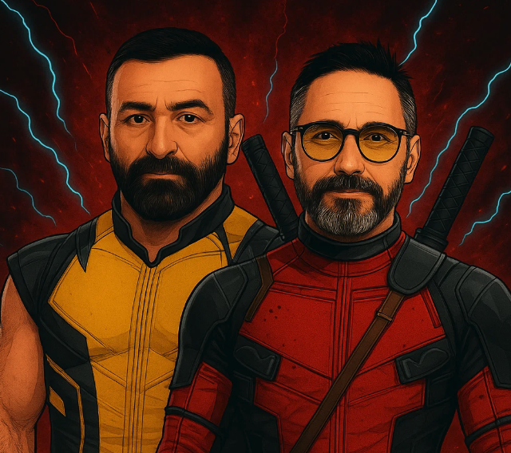
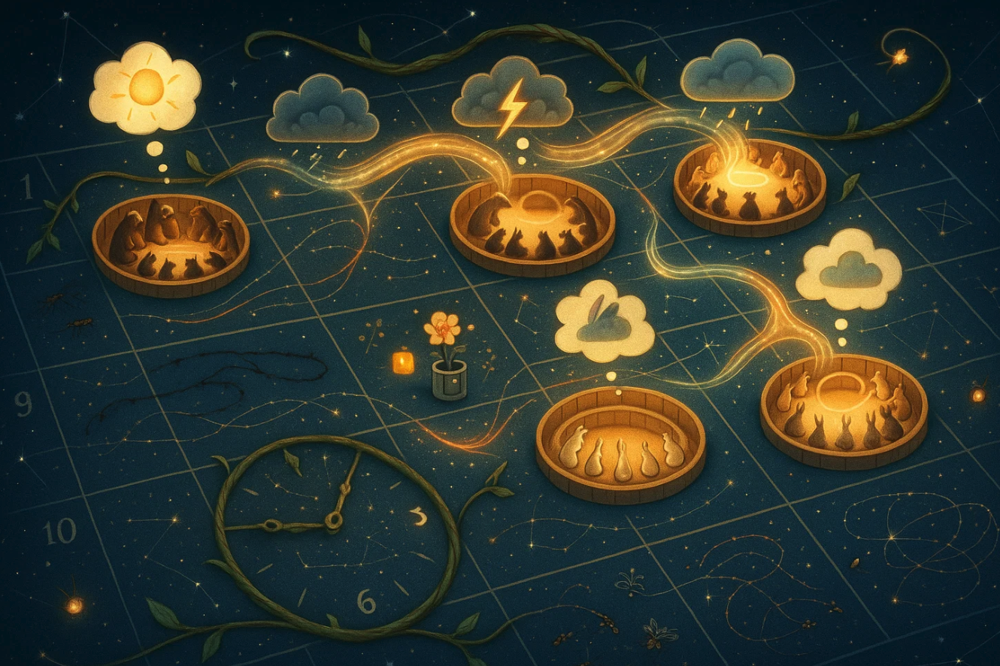
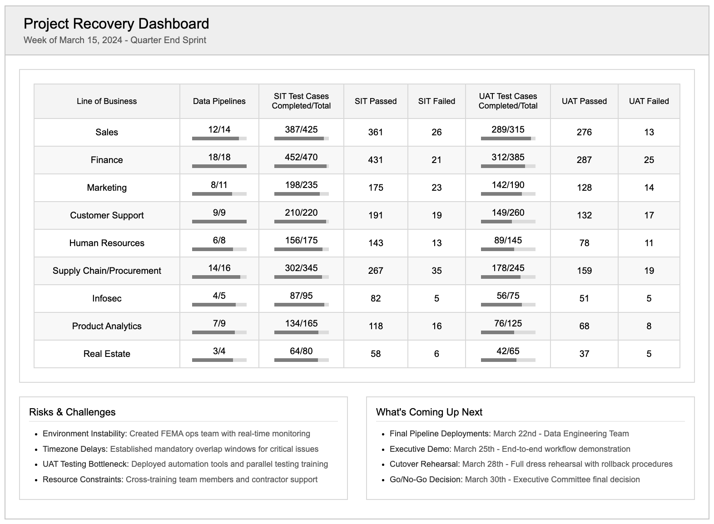
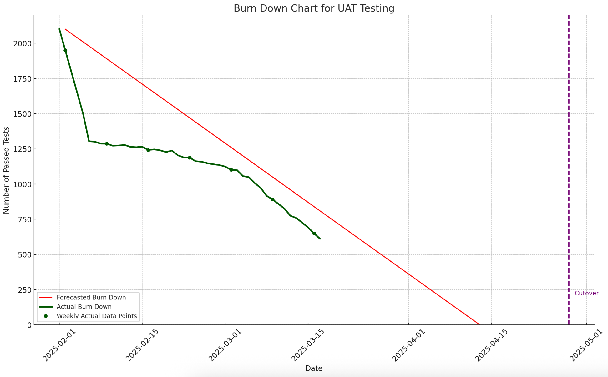
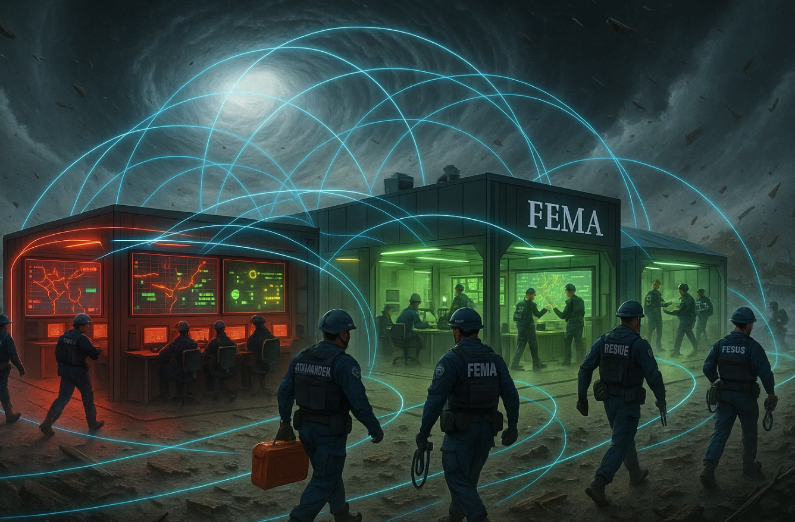
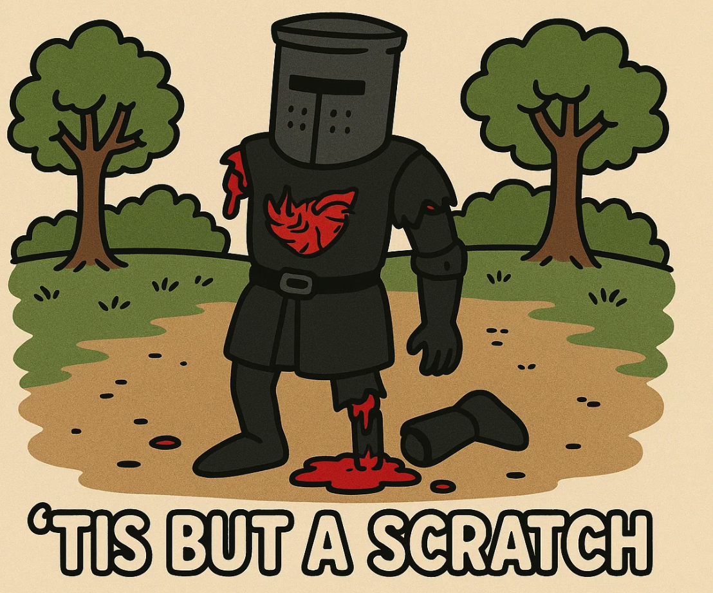

*Source: The author*

## Backdrop
I still remember how it started. I was in Austin on a Saturday, enjoying the Data Day Conference, one of my annual self-indulgences, when I got a call from an SVP I knew. Odd. While he and I had a great relationship, we hadn't worked for a while; I knew something was up. After some niceties, he told me I was a major topic of conversation on the CIO's Friday call. The context was that a complex multi-million data migration project was deep red, and the CIO wanted to revamp the leadership to get it back on track. The SVP, knowing I had a deep passion for data, had floated my name as a candidate to take over the data space and drive this project and the org, and all his peer SVPs concurred. It just so happened that I was between jobs within the company, so the timing appeared perfect. Another few SVP calls and an 'inspiring' CIO call later on Monday I found myself as the Head of Data Platform and Data Engineering group for the company!

## The Framework: Two's a Company
The CIO leadership team had thought it through. Along with the need for a total revamp for the product line, they also noticed material weakness in the technical program management. So they also assigned a senior Technical Program Manager, Sam Wingo, to partner with me. This was a brilliant call. Along with ensuring the technical aspects of the project were on sound footing, the program also desperately needed structure and clarity on measurable progress.
For big budget programs, a two-in-a-box technical and program leadership is essential. The reality is that there's typically a wide palette of players involved in these complex initiatives - internal delivery teams, external delivery partners, internal customers, executive leaders, infosec and technical operations teams, and so on. Interacting with all of them effectively requires a tag team with complementary skills.
The optimal team dynamic here is a partnership of equals with no egos. Chemistry matters, though competent senior leaders are typically able to figure out how to work effectively with any personality type, so this usually isn't a major roadblock. What's crucial is that both leaders maintain strong opinions, lightly held. They must vigorously debate approaches, sometimes taking opposing sides just to test assumptions. In troubled projects where the clock is ticking, time is not on your side. You cannot afford to make wrong moves because there's no slack left in the timeline for course-correction. This is why stress testing solutions and approaches to problems prior to putting them in play is essential.
This dual leadership approach excels at expanding the possibilities. These projects typically need to flex and pivot, perhaps multiple times. Assessing the situation, discussing options, and adapting becomes crucial. Having opinions from two seasoned leaders helps stretch the universe of possibilities and ensures the most optimal path is selected.
Perhaps most importantly, you're not alone. Having a partner who is equally committed to winning gives you a feeling of strength. There's never a moment where you feel isolated - your partner is just a phone call away to talk through anything at all.
Given the late stage this project was in, it needed exactly this combination. While a two-in-a-box approach at project inception might easily pair a product leader with an engineering leader, this troubled project required the TPM/Tech combo to provide the structural rigor that had been missing.

### Setting up the partnership

This was a team of equals with no egos. Chemistry mattered, though competent senior leaders are typically able to figure out how to work effectively with any personality type, so this usually isn't a major roadblock.
We both knew there wasn't much time and every hour counted. For that purpose, we were always talking or texting adhoc, discussing issues as they came up. We would spend time preparing for major meetings, or discuss approaches to talk to certain stakeholder personalities, or sometimes just to vent to each other!
Most importantly, we both colored outside our lines. In times of war, there are no rigid roles and responsibilities - just taking the right call fast. For instance, I was totally cool if he had to talk or direct anyone in my org about a deliverable. He felt the same way if I was setting up and orchestrating weekly all-hands calls with all the stakeholders. The project came first, not our individual domains.

### My partner
Since I was the engineering leader responsible for the project, I will talk about my Program Management partner. This should help you identify the skills and personality traits required in a TPM for a major project going sideways. 
Sam brought something our troubled project desperately needed: the Winston Wolf mentality.
His approach was fundamentally different from traditional program management. Where others might get paralyzed by the complexity, Sam would calmly assess the facts: What's the real timeline? What are the actual blockers versus perceived ones? Who has authority and who doesn't? He had this ability to cut through the noise and identify what really mattered in a matter of hours, not days or weeks. One thing I learnt from him is, just pick up the phone and talk to the person.
What made him effective in this crisis was his work ethic and calm under pressure. I remember collaborating with him at three in the morning during that final push. He had this ability to stay focused and rally the team around a clear goal, maintaining that singular belief in winning even when things looked impossible.
Sam was the perfect complement to my technical leadership because he brought the structural rigor that our project had been missing. While I focused on the engineering challenges, he ensured we had a plan that people actually followed - and the authority to make them follow it.

## Mindset

### “We will succeed”

Perhaps the most important ingredient for both of us was the mindset that no matter what, we were going to succeed. We completely believed in it. This does not mean we acted fool hardy and expected the laws of physics to bend to our will. Later in this writeup, you will see that we had a highly data driven approach towards running this project. 

What this means is that there in our bones we did not internalize that “we will try our best”.  There were no marks here for effort. There was a hard financial penalty facing the company if we did not hit the date. This was all about finishing the job. While both of us didn’t ever explicitly talk about this mindset, we could sense that both of us held it.

By focusing on “success”, you are choosing how to feel. You feel optimistic, positive, energized.

Conversely if you focus on “not failing” you are essentially leaving the door open to allow the feelings of  pessimism and negativity to come in. 

There were moments deep into the project that things were going off the rails. That was the time we just had to create a “positive” echo chamber amongst ourselves and will the project forward. If you stop believing you will be successful, your team will stop believing this. As a leader, you’re the source of the river of positivity which feeds all the fields downstream.

Sometimes, there were folks in the team pushing back that things could not happen. The approach we went in on every one of these types of conversations was not “No, and this is why, but Yes, and this is how”. 

You have to keep asking what else. You have to know this space deeply to come up with creative ideas. And typically there is always a way, a path forward. It may approximate the result instead of hitting bulls eye. Sometimes it may require taking on technical debt. But in my mind when time is not on your side, all these shortcuts are allowed. You just make a note of them in your backlog, communicate clearly with leadership your tradeoff decisions and how you will address them later on, and then come back to it in future releases.

### Being vs Doing

Most leaders focus obsessively on doing - the external, visible activities that fill our calendars and define our professional identity. But what I discovered during this project was that the quality of your actions is fundamentally connected to what you're being in any given moment.
Take a simple example: if you're being "tired," the same task becomes sloppy and ineffective. But if you're being "refreshed and alert," that identical task gets executed with precision and insight. This matters exponentially in stressful circumstances where there's no room for error.
During our troubled project, I learned that I needed to be intentional about being curious rather than defensive, being positive rather than reactive, being expansive rather than constrained. When I operated from these states of being, I found that the actions I executed had a degree of quality, intensity, and efficacy that would otherwise not be there.
In the heat of a crisis project, taking regular breaks from doing mode feels counterintuitive. But whether through planned short breaks, meditation, or prayer, these moments of intentional being weren't a luxury - they were what enabled the doing to be effective at all. By temporarily stepping away from the duties and dramas that bombard us, what's in the background becomes foreground, and what's waiting in the wings gets an entrance cue.

### Exhilarating vs Overwhelming
Often under pressure situations, there can be a mindset that sets in where things feel overwhelming, and that can take your thought process into a myopic place. Your options reduce and you start to become more tactical versus more expansive in solution finding.
Personally, I have identified this happens in three specific circumstances.
**Overload of partial information:** First, when you are getting an overwhelming amount of partial information, mostly in workshops or group settings where folks are talking about topics which they have background behind the statements they are making and you don't. You are trying to just connect the dots as they speak and understand it versus trying to understand and real-time problem solve it. Even when you're successful in keeping up with them, you will only emerge out of the conversation with more problems in the list and not a clear path to resolution. This is when you need to know that it is fine and totally expected. Your goal is to review this meeting afterwards consciously by using notes or unconsciously while running (or sleeping over it) to allow you to further fill in the puzzle pieces and be able to stand back and look at the missing gaps. That is when you will start coming up with solutions. Now, whether those solutions are optimum or not, it doesn't matter. What matters is that they start giving you hope and optimism of a better "future state" and that switches you out of the overwhelm state into the exhilarated state: the state where you feel like you're in the zone, much like basketball professional players who are in heated combat but are hot and are making all the right moves. Note that this state becomes less and less common as you get deeper into the project as there are fewer situations/conversations where you're just trying to 'keep up'.

**Not rested enough**: Second, you're simply not rested enough, and are in a meeting or dealing with a situation which is intense and your amygdala is trigger happy in this state. You need to always know that when you're in this state, and there will absolutely be situations in such a project when you will find yourself in this state, that you would ordinarily be not as excitable and not as emotionally high sinusoidal as you are when you are tired. Just knowing that lets you look at yourself from a distance just for a moment, and helps you calm down.

**Fear of the unknown.** There are some blanks in your mental model of the problem.  When you know something, the fear goes away. In large projects there are always so many moving parts that as a leader you can indeed find yourself wondering if there is something you have left out. This is actually a good feeling to have, even if it feels uncomfortable. This motivates you to learn more. In this case, what I've seen is helpful is to talk through it with an LLM as my rubber ducky. In software engineering, "rubber duck debugging" is a method where you explain your code line-by-line to an inanimate rubber duck to find bugs - the act of articulation often reveals the problem. Typically in these situations you'll find that as you articulate the issue verbally or in written form you will identify the gaps in your understanding where your brain was attempting to smudge across (and incidentally which was giving you the bad feeling). These gaps will help you ask the right questions, or get GPT/Claude to help you figure out the right questions to ask, which then you get answers from in the org.
My experience is that the BEST way to get out of the overwhelm state and into the exhilarated one is to go deep into the details. Understand and really grasp the details of the problem, or maybe even one part of the problem. The fear of the unknown starts to move away and you will start seeing opportunities or solutions. If the problem requires special SME that you don't have, you will be able to find the right talent in your team who does have it. You do NOT delegate this problem. Not at all. Instead you take an hour and call this SME to get to the bottom of this issue and understand it. "Just pick up the phone," and you will see that the SME will already have ideas to solve it, and with your vantage point (i.e. you can see things the SME can't) you may be able to provide other options to explore. In all cases you are moving out of the myopic mental state, into an expansive mental state. I have frequently felt hits of endorphin and mild euphoria as I'm moving across these states into a better place.

## Forensic Analysis
Before you jump in and start executing, it's always a good idea to step back to a hill close by and survey the battle grounds. This gives you a good idea of how to formulate strategies and perhaps avoid making similar mistakes.

### Take a moment to pinpoint the inflection point

Sometimes a project goes south slowly like a frog in water which is slowly boiling. Then there is typically an event, an inflection point, which shifts the sentiment of senior leadership and gets them to take action. In my mind, it's an important piece of data for you to gain, since it helps you know exactly where to invest your energy when you get going. The reason is if you are able to turn around this specific cause in the beginning, you start getting quick wins under your belt, and your leadership team knows they bet on the right horse. You can get close to finding out what this inflection point is by asking around folks specific questions, but also check out prior recordings of major meetings where the leadership participated. This is how I found out about this project's inflection point.
When there is a sudden change in a project, it is typically because of some key event. There is something a senior leader has seen or heard which changes their level of confidence in the project status to take drastic action. Many times, the new teams walk straight into a project and start reshaping it but don't take the time to assess exactly what "broke the camel's back". It doesn't take long, but can be very insightful so that the new teams can focus on the major pain point in the senior leader's mind.
In our case, there was a video recording of a weekly project call where this transpired. We listened to it a few times and very closely and saw a few patterns on this call:

The project turned color from yellow to red, however there was no objective measure violation reported.
There was no clear milestone identified with a specific date to show a path to green.
There was one stakeholder, we will call him Bosch, who was the loudest in terms of communicating concerns.
When the senior leader asked Bosch if they thought the project would finish on time, the leader said they did not think it was going to be extremely hard.

The insights that we derived from this were clear: the project needed hard objective measures to track progress, and colors needed to change when some pre-defined thresholds were crossed so the leadership team could see it coming from a distance and have time to react and help. The project also needed specific middle milestones with dates all the way to final cutover, with daily tracking on progress. Most critically, the loudest stakeholder "Bosch" was the leader of the pack - his sentiment carried a lot of weight and other stakeholders swayed with his opinion, which meant we needed to win back his confidence.

### Project Assessment

How much time you have dictates your strategy: 2 quarters or 2 months?

In troubled projects you seldom have a year or more than 2 quarters as it's already too late and the project is red. You are the ER doctor going in trying to save the patient's life.

In our case we had about 1 quarter left.

Sam and I spent a bunch of time together originally just understanding how the project got here, where things started to go awry, and our key strategy on this project. The war was going to be fought on three fronts.

First, we needed to turn the executive perception 180 degrees to drive confidence in the new approach. Our strategy was to turn the progress measure to data, which meant numbers and dates. This gave meaning to the colors, defining what red/yellow/green meant. The prior team was not quantifying what a yellow was, and it drove a different emotion in each executive based on their own meaning of the color.

Second, we had to change the stakeholder perception. This meant we needed to listen, truly listen, to the stakeholders. Give them the mic. Bring them together to talk to each other - don't be afraid of them "ganging up", make it a collaborative environment. This was an ignored lot, with short term and long term woes with the team. We needed to give them hope for not only short term improvements (like the finance team's lack of confidence in numbers), but also long term hope that more customer-centric leadership was in charge.

### Team Assessment
I was dropped in to a brand new team. I had to quickly assess the skills of the leaders and the lead engineers and product managers and the main delivery partners.
I found that these were solid individuals. Top class engineering managers, and very hard working and tuned in engineering team.
Also the partner had deployed solid folks to complement us.
The team had been doing good work, but just the volume of work was so enormously large, it was impossible to fully do QA on everything.
It was also a key contributor of team burnout.
The engine was solid, but the car's dashboard needed an uplift, and the drivers needed to get in the Le Mann's mindset. This was the last part of the marathon that needed to be sprinted to the end.

## The Stakeholder Influence Campaign
Relationships matter, as they build trust and confidence. In troubled projects, stakeholders have often been burned before - they've heard promises that weren't kept, seen timelines that weren't met, and experienced communication that felt more like spin than substance. The accumulated skepticism creates a defensive wall that's hard to penetrate with PowerPoints and status reports alone. But relationships cut through all of that noise. When people trust you personally, they're willing to give you the benefit of the doubt. When they feel heard and valued, they become collaborators instead of critics. And when they see you as someone who genuinely cares about their success, they'll move mountains to help you succeed too.

### Establishing direct connection with key stakeholders
One of the first things to do is schedule 1:1 meetings with the stakeholders, starting with Bosch, the leader of the pack. The timing works in your favor here - they're already feeling heard because you're there, and they have some hope because new leadership represents a fresh start. They've had challenges with your team in the past, so there's pent-up frustration they want to express. But here's the beautiful part: you don't have any reason to be defensive either, so they will tell you everything flat out. This is great input for you to work with your team and change the perception others have about them.
I approached these conversations with genuine curiosity rather than trying to defend past decisions I had no part in making. "Help me understand what's been frustrating you." "What would success look like from your perspective?" "If you could wave a magic wand and fix three things about this project, what would they be?" The goal wasn't to solve everything in that first meeting - it was to truly understand their world and let them know they had been heard.
What surprised me was how much valuable technical and business context emerged from these conversations. Stakeholders often understand the practical implications of technical decisions better than the engineers do, because they're the ones who have to live with the consequences. They know which data quality issues actually matter to the business and which ones are just theoretical problems. They understand the political dynamics that affect project success.
I kept going with bi-weekly check-ins with the key stakeholders for a month or so, to keep them warm and make them feel heard. These weren't formal project updates - they were relationship maintenance. "How are things going with the latest build?" "Any new concerns I should know about?" "What's working well that we should do more of?" The investment in time paid dividends later when we needed their patience during difficult moments or their advocacy when explaining delays to senior leadership.

### Get leaders and lead engineers together in 1/n series to review challenges
We set up a tight 30-minute all-hands every week where we invited ALL the stakeholders and senior director level leaders. It was jointly presented by myself, Sam, and each of the appointed leads of the stakeholders, and very tightly choreographed down to the minute on who was going to talk and how long. The goal here was what I had heard while talking to the executives in the stakeholder groups - to be more inclusive and cross-share across all teams. We also wanted to give them a relief valve. We were asking for a lot from them in a short time, and tension, stress, and frustration was going to be there. We wanted them to share and express progress, but we didn't make it a free-flow open mic "complain fest" as that quickly goes out of control.
For each stakeholder's slide, we had a section called "how are you feeling" and risks/issues/concerns where we allowed them to share their issues. This helped them put this data down in objective terms, allowed us to follow up with these issues, and also showed to all the rest of the leaders that we were listening to our customer base and adapting, thus fostering goodwill.
Between these weekly sessions, my team ensured we enabled all the access required for the UAT testers ahead of time, asked them to confirm access, and told them explicit SLAs around defects so they would know what timeframe to expect and not start escalating arbitrarily. We made small but crucial tweaks to their test cycles by telling them to start testing on the data that was already built for the day, especially if it was early in the pipeline, instead of waiting for the 10-hour long batch job to complete. We gave them tools and monitoring on what was ready for them to test and review on a daily basis, and asked them to log their tests in a standard way so we could pull that data into our reporting.

By exposing each stakeholder's work, we started seeing common patterns. When we reviewed these tests and saw patterns on how each stakeholder group was doing similar tests around data quality, my team built them standard automation and provided them the tests. We worked with a friendly stakeholder - Sales - and had them run the automation. When they were quickly able to close out a lot of the cases, we brought them into the next weekly call to share their findings and dramatic progress, essentially asking them to "sell" the automation to their other stakeholders.
We also created easy and automated ways for them to file defects right in Slack instead of sending them directly to the ticketing system. The automated form ensured that bug hygiene was maintained and we collected all the required data we would need to later do analysis on them.
These weekly sessions - where the series ended up being exactly 10 - helped us also do sneak peeks of new capabilities we were bringing to the stakeholders to help them make their testing experience better and provide richer information to them.

## Battle Tactics (Engineering perspective)
When a project is hemorrhaging and stakeholders are pointing fingers, most leaders retreat to conference rooms for PowerPoint therapy sessions. But here's the uncomfortable truth: you can't manage what you don't viscerally understand. If your fingers aren't in the dirt, if you haven't personally navigated the broken systems your team battles daily, then you're just another well-intentioned executive managing shadows instead of substance. Real turnarounds require leaders who get their hands dirty with the actual technology, data, and processes, not just the sanitized summaries that float up through organizational layers.

### Hands-on leadership
Just having high-level "prepared" conversations doesn't cut it. If a leader only relies on the perception of others, and prepared content, they will only have a surface level idea of the issues. In technology, I have always found having a visceral idea of the problem or issue is crucial.
Note that this requires a little more time investment than just conversations. Sometimes you need to corroborate to confirm.  For me, it required getting read-only access to the data warehouse systems, the data pipeline tools, and the code repositories. Specifically in this situation, I knew SQL so the warehouse part was not a problem, but I had never used the specific data pipeline tech that was being used, so I had to spend some energy learning that tool.
### How to quickly learn new technology as a leader
You need to get into the hard data to viscerally grasp each issue that crops up. This requires you to be deeply technical and put your fingers in the dirt. If you've become a technology leader, chances are the technology is either a home grown system your team developed, a 3rd party vendor technology your team is enabling for the company, or some combination of both. You need direct access to this technology as both a user and developer - no ifs and buts. Just like a head baker tastes her goods in the bakery, you need to do the same.
This means getting your hands on these systems and spending just enough energy to learn them quickly enough to be deadly. The beautiful thing about being a leader of this tech is that you can have dedicated sessions with the lead engineers who can walk you through the setup and general understanding. It pays to read the technical documents ahead of time, but nothing beats seeing it in action.
I typically record these sessions just for myself, so I can go back and review, pausing on the screens where I see them issue certain commands or click specific buttons. Then I try to replicate the same actions through my own access. There's something about muscle memory that accelerates comprehension - when you've actually navigated the system yourself, you understand its quirks and limitations in a way that no documentation can convey.

**Pro-tip:** In tech delivery firms, chances are you have a global team. I typically reserve my deeper learning sessions with team members in evening timezones. This means setting up adhoc calls with technically savvy individual contributors in the India timezone so they can walk me through the setup, then I spend time emulating that setup and exploring the system to understand its edges and overall shape. Evening times work better anyway, since you don't have meetings peppered throughout and can actually do some deep work.

### When a statement doesn't fully make sense (or "Be comfortable being dumb")
Remember that when you're understanding technical concepts or issues, the people sharing those details are on a spectrum of communication skills. Some try to simplify concepts before they share them, others stay at their technical level. Then you have the added complexity of English not being a native language for some of these individuals, which can make understanding a complex issue even harder.
Here's what I do. I listen carefully to any issue or problem being surfaced. The moment I hear a sentence that doesn't completely sink in, I interrupt and stop right there to get clarification. I shamelessly keep asking all the dumb questions until I understand it. I never move off that key topic until I've grasped it fully. This is critical because subsequent concepts build on this foundation - if your understanding is shaky from the start, you won't truly understand what follows either.

With time and experience, you start caring less about the "perception" you're creating in the conversation and focus more on getting to the facts. This is now "your" team, and you have every right to be "comfortably dumb."
Here's the thing: at work, you can spot leaders who understand level 1 of an issue but when pressed for details, their limited grasp of the full problem and its impact becomes evident. In your troubled project, you can't afford to run your ship with partial understanding - that's likely what got the project into this state in the first place.

Many times this required me to talk to engineers several levels below me who were closer to the actual situation. There's no shame in going directly to the source. The individual contributor who's been debugging the issue for three days often has insights that got lost in translation as the problem moved up the management chain. Your job is to understand the truth, not to maintain some artificial hierarchy of information flow.

### Data "always" neutralizes emotional valence
I have been dropped into many complex and troublesome situations in the past, from a broken enterprise delivery pipeline in a software organization, to solving Obama's healthcare.gov technology issues. In all scenarios, since the project has gone south, emotions are typically running high. You get a sense that teams are distrusting of other teams. The project delivery team is chagrined with the customers who are changing or adding to requirements, while the customers are not happy with the progress or the quality of what has been delivered thus far. As a leader you need to set a positive tone immediately.
In all situations, I tend to rely on data to set the tone. Showing data takes the conversation from subjective to objective, it exposes the actual problems, which may not look pretty but you gain trust back by being honest, you also have clear targets to hit which makes measuring success easier. When people are arguing about feelings and perceptions, there's no winning - everyone retreats to their corners and defends their position. But when you put real numbers on the table, suddenly everyone is looking at the same reality. The data doesn't care about politics or personalities or who's been on the project longer. It just is what it is.

In our cases, our weekly steering committee calls became a clinical readout on the number of tests completed, passed, pipelines developed, and challenges we were experiencing.

Ofcourse, each test failure could bring its completely unique challenges to solve, and those were just on Sam and I to solve with the teams, in hand-to-hand contact.

### Burn down graphs

When the clock is winding down, honing in on a critical metric and tracking its burn down before the deadline are helpful. These aren't your typical agile story point burn downs - they're laser-focused on the one metric that matters most for project success. Maybe it's test cases completed, maybe it's data migration percentage, maybe it's defects resolved. Whatever it is, you track it relentlessly and make it visible to everyone.
In our case, when we implemented test automations and our stakeholders used them, there was an immediate acceleration of the passed test case burn down. This got us good will quickly with our senior leaders who could see that the trend was now looking positive. The graph became a daily conversation starter, a source of motivation for the team, and proof to skeptics that our new approach was actually working.

*Note that the graph was not really linear. The easier tests were front loaded by all our stakeholders, and things got more complex later.*

## It's all about the humans!

Here's what I've learned after decades of running complex technical projects: the human aspects always outweigh the technical challenges. You can have the most elegant architecture, the most robust infrastructure, and the most sophisticated tools, but if the people aren't aligned, communicating effectively, and working toward the same goals, the project will struggle. Technology problems have defined solutions - you debug, you optimize, you refactor. People problems are messier, more nuanced, and often the real reason projects succeed or fail.
Every troubled project I've inherited had perfectly capable technology at its core. The breakdown was always in how the humans interacted with each other and the technology. So let's talk about all the various personas involved in a technical project and how to think about each one.

#### Managing the delivery team (or provider)

In some circumstances, there are large implementation contracts in place with providers who are there to provide the capacity and skillset to accomplish a major lift that would have taken your internal team years to complete. In my experience, none of these vendors have bad people - in fact, for major projects they typically assign their top talent, as was the case here.
The challenge is usually how the relationship has been set up and whether there are clear expectations and detailed review processes to ensure nothing gets lost in translation. Without this structure, it's easy to start a blame game saying it's all the partner's fault. But it's typically never the partner's fault.
What happens is that your internal team has context about the business, the users, the political dynamics, and the technical debt that the vendor team simply can't have. Meanwhile, the vendor team has deep expertise in the specific technology and implementation patterns that your internal team may lack. When these two knowledge bases don't get properly bridged, you end up with technically sound solutions that don't quite fit the business reality, or business requirements that are technically impractical given the constraints.
The key is creating structured touchpoints where this knowledge transfer happens continuously, not just during the initial requirements phase. Regular  reviews, joint problem-solving sessions, and embedded team structures where vendor and internal resources work side by side rather than in separate silos.

#### So many issues, enter FEMA ops
We started seeing a lot of issues in the UAT environments, where new code was entering at the same time teams were testing, creating a perfect storm of instability. Further, as some of the data tables were getting fully completed, they were being "turned to production," which meant stakeholders could start using that data for their production use cases. The problem was my operations team hadn't gotten any exposure to this new buildout yet.
The situation was becoming untenable. Stakeholders would report issues, but there was no clear ownership or process for rapid resolution. Problems would sit in limbo while the development team tried to figure out if it was a code issue, a data issue, or an environment issue. Meanwhile, stakeholders were losing confidence as they watched the same problems resurface day after day.
So I set up a temporary operations team called FEMA Ops, playing with the emergency management agency term to signal that this was a short-term team focused on bringing stability to chaos. We started treating every issue in UAT as if it were a production incident - full triage, regular updates, clear resolution paths, and mini RCAs for anything that took longer than expected to fix.

The psychology of this was as important as the process. By calling issues "incidents" and treating them with production-level urgency, we changed how everyone thought about them. Suddenly, a "UAT bug" became a "P2 incident" with an assigned owner, expected resolution time, and stakeholder communication plan. The development team started taking UAT issues seriously instead of treating them as "we'll get to it eventually" items.
This approach stabilized the environment enough to give our stakeholders meaningful time to test, but more importantly, it built confidence that things were getting better. When stakeholders could see that every issue was being tracked, communicated, and resolved systematically, they stopped worrying about whether problems would get lost in the shuffle.
Lesson: Sometimes the solution isn't fixing the underlying problem immediately - it's creating a reliable process for managing the chaos until you can fix the root cause. Stakeholders can tolerate issues if they trust that those issues are being handled professionally. What they can't tolerate is uncertainty about whether anyone is actually in control.

#### Singular accountability assigned leads to progress

There's a misnomer that singular accountability is just about assigning a project to a competent person and stepping away. My approach is different. There are tons of tasks that need to be done during any project, and my approach is to clearly give each task to a singular owner and then support them in getting there.
I continue to stay close to them, show genuine interest in their approach, be their cheerleader with my chain of command as they put forth their plans and accomplish them, and really invest myself in each step of execution as they move toward their goal. There's a difference between hovering over someone's shoulder and being genuinely invested in their success.
In my experience, this type of attention tends to motivate A-players tremendously. Finally, someone is seeing what they're truly capable of. They feel the weight of real ownership, but also the support to execute at their highest level. Soon, they start signing themselves up for new issues that crop up, becoming force multipliers rather than just task executors.

There were so many examples of this happening in our project. When I mentioned that quite a lot of the initial tests were common, simple, and needed to be repeated, one engineering leader raised her hand immediately. She ran with the automation of those tests (something I had alluded to earlier in the burn down charts section) and this really made a big dent in our progress. She took ownership not just of the immediate task, but of the broader problem it represented.
Another example: since we were moving to cloud, the older orchestration bottlenecks were going away, but new bottlenecks hidden behind them were emerging. Specifically, we started seeing an intense amount of writes coming all synchronized to our audit logs, which was causing blocking to the processes randomly. It turned out our cloud-based orchestration was running much faster and causing a sync of the start of the heavy batch jobs. I just talked to a leader on the team one evening about it and asked him to see what options we had. He jumped on this hands-on with his leads and came up with multiple approaches to solve it, including using some advanced but cutting-edge technologies from the data warehouse. In the end, he chose a random staggering approach based on prior data runs, which solved the issue elegantly.
**Lesson:** Singular accountability is about clarity of ownership combined with support. When people know they own something completely but also know their leader is genuinely invested in their success, they perform at levels that surprise even themselves.

## Managing Upwards

The leadership that has put you in charge of this troubled project knows they're taking a calculated risk. They've likely tried other approaches that didn't work, and now they're giving you carte blanche authority to do whatever needs to be done. They don't want to micromanage the details - they just want to know that things are getting back under control and staying that way. Your job is to give them confidence through consistent communication, early warnings on problems, and evidence of tangible progress.
The key insight here is that senior leadership doesn't want surprises, but they also don't want to be pulled into the operational weeds. They want to see that you have a plan, that you're executing against it, and that you'll escalate to them when you need their help with specific decisions or obstacles. Managing up in this context is about building trust through predictable communication and reliable delivery.
#### Your chain of command
It's good to have end-of-day 15-minute meetings every day with just your chain of command, and that's what our SVP set up with Sam, myself, and my manager. These calls were never actually 15 minutes, but they were a way for us to give a pulse to our leadership on how things were going, run by them slides and content we were going to share with the more formal steering committees, or get their input before our weekly Friday calls with the CIO.
Many times we got actions and todos on these calls, and the trick was to execute and deliver on these quickly. They were mostly related to data and measurements around the project, so that typically meant taking an engineer aside, sharing the requirements, and getting the scaffolding built out. Quick turnaround on these asks also drove confidence with our leadership - they could see that when they made a request, things actually happened.
These evening meetings went from daily to twice a week by the middle of the quarter as confidence built and the rhythm became more predictable.
#### Senior leadership
We had bi-weekly steering committees on Wednesdays, and the content preparation for those started three days before, typically by end of day Friday. Sam handled this cadence masterfully. The idea was to ensure that content was pre-shared with our chain of command, and then with the CIO, before all his other EVP peers got to see it on the call. If there was something red, typically Sam or I already had our irons in the fire working on it. But in those cases, we always gave a 1:1 heads up to the senior leader impacted so they wouldn't be hearing about it for the first time on the call. We had already diffused their initial response and taken their feedback.
The goal was to ensure these steering committee calls went smoothly and cleanly with teams mostly aligned. Our job was to turn them into as clinical a readout as possible - here's where we are, here's what we accomplished, here's what's coming next, here are the risks we're managing.

There's a reason for this approach: when you're bringing up hot, messy, complex topics for the first time in steering meetings without solutions or meaningful progress being made on them, you'll see that all the senior leaders jump in to "help." That's not necessarily a good thing. The other folks they pull in from their teams can easily become a drain and a distraction for you. This is why you need to own your problems and drive them with confidence.

#### Managing your team
The team working on the project was exhausted - emotionally and physically running for so many quarters. With the negative perception swirling around them, they were on the backfoot, lacking inspiration and hope. You could see it in their body language during meetings, hear it in the way they discussed problems with a resigned "here we go again" tone. This wasn't a technical problem to solve - it was a human one.
Recalibration was needed on multiple levels. First, bringing positivity and the "we will succeed" mindset into their thinking and approach. This couldn't be fake cheerleading - it had to be grounded in real changes they could see and feel. Second, leading by example by constantly asking "what else can I do" to make this faster and better, rather than waiting for others to step up. And third, recalibrating the teams to focus on critical items first, giving them a clear sense of priority and progress.
The challenge with demoralized teams is that they've often been burned before by promises that didn't materialize. They've seen new leadership come in with grand plans, only to hit the same walls that defeated the previous leadership. So you can't just tell them things will be different - you have to show them through your actions.

**Pace Setting**
Carlos Alcaraz has a notable quote where he says *"It's not time to be tired."* This reflects his competitive spirit and determination, particularly in crucial moments. When the stakes are highest and everyone else is flagging, that's when champions find another gear.
You have to bring that energy too. And you'll see that all your A-players will start to keep pace as well and begin to generate momentum. Energy is contagious - both positive and negative. When the team sees you taking late-night calls with genuine enthusiasm, when they watch you dive into technical details instead of staying at the surface level, when they observe you taking ownership of problems instead of deflecting blame, it shifts something fundamental in the team dynamic.
Pace-setting is about working with intentionality and urgency that's infectious. When people see that you truly believe success is possible and you're willing to do whatever it takes to get there, they start believing it too. The exhaustion doesn't disappear, but it transforms from the tired feeling of futility into the good tired that comes from meaningful progress.

**Lesson:** Teams mirror their leadership more than they follow their words. If you want your team to believe in the mission, you have to embody that belief in everything you do. Energy and commitment cascade down from the top, but so do doubt and resignation. It's all about what you choose to broadcast.

## Managing Yourself
The most dangerous thing about troubled projects isn't the technical complexity or stakeholder politics - it's how they can consume you if you don't manage yourself deliberately. The intensity creates a vortex that can pull you in deep, and you risk losing perspective and can burn out your decision-making capacity. Self-management during these periods is beyond self-care, it's actually project management. Your cognitive capacity, emotional regulation, and physical stamina are finite resources that need to be allocated as strategically as any budget or timeline.

#### Temporary personal sacrifice: it's worth it
There's no doubt that you'll be pulling longer nights and weekends. But this is something you must commit to fully. In my case, I told my wife that I would be totally consumed by this project until its Go-Live date. She had been on these types of rodeos with me before and knew what this meant. This would require her to bear the brunt of the household work, the kid chauffeuring, the weekend Costco runs - all of it. I am truly grateful for a supportive spouse who didn't bat an eye and went all in.
The key is being explicit about the sacrifice rather than letting it creep into your family life gradually. When everyone knows what they're signing up for and when it will end, they can prepare mentally and practically. It becomes a shared mission rather than an ongoing source of tension.
My experience in turning around projects is that you're rewarded by your leadership in the end in some monetary way. That reward completely belongs to your spouse. I typically just put that money right in her hands. She earned it more than I did.

#### The power of naps!
You're inevitably going to be working really odd hours. You may have to take calls at 3 or 4 AM, or be on at 11 PM. Even for nights where you can sleep all the way through, if you're like me, you may wake up in the middle of the night with your lizard brain jolting you awake in anxiety. In short, your sleep is going to be compromised. For a few months, you'll have to put aside the luxury of 6-8 hours of uninterrupted sleep.
There's a solution for this. It's not a long-term thing, but it will help you optimize your brain and maximize your throughput: take naps! If there were 90 minutes during the day, I'd tell Sam I was going to take a nap and sleep for about 60 of those minutes. He would cover for me during that time. This was especially helpful right before a crucial call where your brain needed to be calm, rested, and your communications smooth. Sleep right before these meetings makes a dramatic difference in your delivery.

The science backs this up - a 20-60 minute nap can restore cognitive function better than caffeine. But more importantly, it gives you permission to step away from the chaos momentarily and reset your mental state.

### Working on compartmentalization

In hard-charging executive roles, I marvel at senior leaders who can compartmentalize the work craziness and put it aside to have restful sleep. My dad was like that in his working days. The way I look at it, every single time such a project comes my way, it gives me ample opportunity to practice "compartmentalization." If I was a librarian, when would I ever get to work on my emotional regulation?
In such crazy projects, you get opportunities again and again to put into practice all the tools you learn about self-regulation and breathing. What was especially powerful for me were the five times I have to pray during the day. They felt like an oasis in the middle of the desert. I could really slow things down and focus on God. The realization during those moments of prayer that despite all the universe swirling around you, you are still only a speck of sand on the ocean - temporary and small, and will be swept away one day like millions of specks before you. That smallness brings a kind of comfort in your chest and replenishes your energy.

Whether it's prayer, meditation, or just stepping outside for five minutes, these moments of intentional pause become lifelines when everything else feels urgent and overwhelming.

## The crescendo and the ending
Things start getting intense and squirrely in the final weeks. The pressure ratchets up exponentially as the deadline approaches, and a lot of nerves start getting tested. Issues that seemed manageable suddenly feel catastrophic. Stakeholders who were patient for months become impatient overnight. Small problems get magnified, and everyone's tolerance for ambiguity evaporates. This is where you have to stay true to the fundamental belief that you will succeed, even when everything around you feels like it's falling apart.
This is where having Sam as a partner was invaluable. We created an echo chamber of "success" amongst ourselves and would find ways to reinforce that mindset when things got darkest. We became each other's source of strength when the external environment was trying to drain it away.
We had a little joke amongst us when a new bombshell dropped on us. We used to message each other "Tis but a scratch!" from the Monty Python show. You know the scene - the Black Knight gets his arm chopped off in battle and declares "It's just a flesh wound!" Then he loses his other arm and maintains it's "just a scratch!" Even when he's lost both legs and is just a torso on the ground, he's still challenging his opponent, insisting he's fine and ready to fight on.

It became our rallying cry. Database corruption at 2 AM? "Tis but a scratch!" A stakeholder tells us they are not going to be able to complete their testing on time? "Tis but a scratch!" Critical data just got corrupted and now the rebuild will take 5 hours? "Tis but a scratch!" The absurdity of the reference helped us maintain perspective and reminded us that no matter how bad things seemed in the moment, we were still in the fight and still capable of winning.

### The 8th Gate

Right in the last few weeks, the issues start coming left, right, and center. I took my three direct reporting leaders and with just them, I had daily calls around each issue that was coming up. The frequency and intensity demanded a different level of response now.
I called this last push the 8th Gate, borrowing this term from the famous Naruto manga. This is the description of the Slack channel I created:
"In the Naruto universe, the "Eight Gates" refer to a set of eight specific chakra points within the body that prevent overexertion. Opening these gates releases these limits, granting the user incredible power at the cost of immense physical strain and potentially fatal consequences. The final, eighth gate, known as the Gate of Death, grants the user extraordinary power, but at the cost of their life."

The metaphor was perfect for what we were doing - we were pushing beyond normal operational limits, knowing there would be a cost, but understanding that this was the only way to achieve what seemed impossible. We weren't going to sustain this pace forever, but we could sustain it long enough to cross the finish line.
There were many challenges we hacked our way through in this forum. For example, the tech partner was getting crushed with the UAT bugs coming from the stakeholders, so my engineering team jumped in and took on the work at risk and completed it. We didn't wait for approvals or formal change requests - we just did what needed to be done.

### Investment in relationships pays off

Right before the cutover, as the other stakeholders behind Finance started getting to the end, the old "latency" problem started appearing. The issue was that when you have two different pipelines taking data from the same source, due to the time delay between the two pulls, the data in the new warehouse does not match the older warehouse. This issue was something we had already tackled in meticulous detail with the Finance team by proving down to looking at the specific records and traversing the data pipeline all the way to the source to prove its integrity and convince them that there was not a defect in the pipeline code causing the difference in the data, but the actual latency issue.
Well, what started happening was that other LOBs started to see this same issue and started failing their tests. This was like 2 weeks before the cutover, and we knew there was no way we could go through and reprove each one of these LOBs the same way we did for Finance. There was no time. This is when I called in on my relationship with the Finance leader, who by now I had a solid relationship with. She joined the call with these LOBs, and when they were pointing this issue out, she was the one who came to our rescue and spoke on our behalf, convincing them that this is a latency issue and telling the story on what had been done before in proving this. We also accompanied one data traversal along with her testimony as a proof point that the pipelines were kosher and there were valid and explainable reasons for the data differences.

This changed the tide. I still remember that day - it was a Sunday morning, and once this had been communicated, we saw that all the other LOBs started lining up and aligning that these were not code issues after all.
I remember calling Sam right after that call and we both felt the same thing - that we had this in the bag now! It was quite a relief.

### "We will still be there after the cutover"

Another big worry that the stakeholders had was this was a brand new system and they didn't know if they were ready and skilled to support it. I made it a point that we were focused on the cutover first, and I purposely decoupled the ownership handoff to a quarter later. I also convinced my leadership to support extending the contract with our delivery partner as they had the most knowledge in the new pipelines that had been built, so they could be there to support and provide detailed knowledge transfer to us post migration. They created a full curriculum that we shared with our stakeholders too and got their inputs for enhancements. These actions seemed to calm the nerves of our stakeholders and they started to lean more towards the Yes versus a No.

### Here comes the migration!
We had a meticulous multi-day cutover which went flawlessly thanks to the great planning done by the engineering team, and we showed up with a 24x7 hyper-vigilant post cutover support. There were surprisingly very few issues, and even the issues we found were because we never knew the warehouse was being used that way all the time, when we had some unexpected user's process break. No issues - 'tis but a scratch - we kept moving forward and fixing them, and pretty soon we were looking at a smooth end of the hypercare period.

## Reflections

I remember the last steering call we had on this project. The cutover was completed, the older system was getting ready to be physically decommissioned, and the CIO got on the call. He was literally at a loss for words. He said he really thought we were not going to be able to make it, and he just couldn't express his amazement at what the team had accomplished. His voice cracked slightly as he spoke - this was a leader who had seen it all, but even he was moved by what we had pulled off together.

There was something profound in that moment of silence before he spoke. All those late nights, all those moments when it felt impossible: it all crystallized into this single moment of recognition. We had done something that felt impossible just months before.

Over the next year, this platform was going to provide tremendous uplift to our business, and the new innovations it brought took the company to the next level in terms of speed and capabilities. 

But more than all that, what I take away from the experience were the relationships that were forged in fire. There were amazing people I worked with that I will never forget for the rest of my life. Ankur, Smitha, Bharti, and their spectacular team members, and most of all Sam. When you go through something like this together, when you push beyond what you thought was possible and refuse to give up on each other, it creates bonds that last forever.