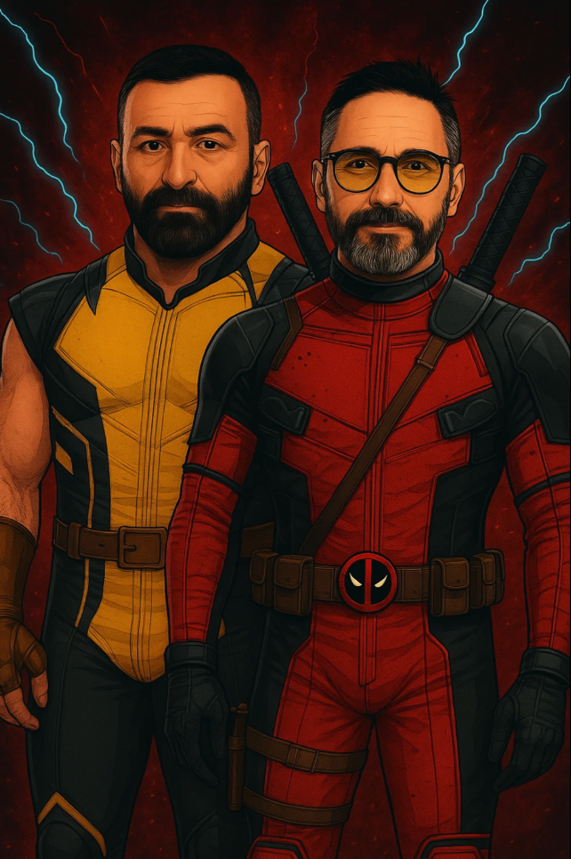

*Source: The author*

## Backdrop
I still remember how it started. I was in Austin on a Saturday, enjoying the Data Day Conference, one of my annual self-indulgences, when I got a call from an SVP I knew. Odd. While he and I had a great relationship, we hadn't worked for a while; I knew something was up. After some niceties, he told me I was a major topic of conversation on the CIO's Friday call. The context was that a complex multi-million data migration project was deep red, and the CIO wanted to revamp the leadership to get it back on track. The SVP, knowing I had a deep passion for data, had floated my name as a candidate to take over the data space and drive this project and the org, and all his peer SVPs concurred. It just so happened that I was between jobs within the company, so the timing appeared perfect. Another few SVP calls and an 'inspiring' CIO call later on Monday I found myself as the Head of Data Platform and Data Engineering group for the company!

## The Framework: Two's a Company
The CIO leadership team had thought it through. Along with the need for a total revamp for the product line, they also noticed material weakness in the technical program management. So they also assigned a senior Technical Program Manager, Sam Wingo, to partner with me. This was a brilliant call. Along with ensuring the technical aspects of the project were on sound footing, the program also desperately needed structure and clarity on measurable progress.
For big budget programs, a two-in-a-box technical and program leadership is essential. The reality is that there's typically a wide palette of players involved in these complex initiatives - internal delivery teams, external delivery partners, internal customers, executive leaders, infosec and technical operations teams, and so on. Interacting with all of them effectively requires a tag team with complementary skills.
The optimal team dynamic here is a partnership of equals with no egos. Chemistry matters, though competent senior leaders are typically able to figure out how to work effectively with any personality type, so this usually isn't a major roadblock. What's crucial is that both leaders maintain strong opinions, lightly held. They must vigorously debate approaches, sometimes taking opposing sides just to test assumptions. In troubled projects where the clock is ticking, time is not on your side. You cannot afford to make wrong moves because there's no slack left in the timeline for course-correction. This is why stress testing solutions and approaches to problems prior to putting them in play is essential.
This dual leadership approach excels at expanding the possibilities. These projects typically need to flex and pivot, perhaps multiple times. Assessing the situation, discussing options, and adapting becomes crucial. Having opinions from two seasoned leaders helps stretch the universe of possibilities and ensures the most optimal path is selected.
Perhaps most importantly, you're not alone. Having a partner who is equally committed to winning gives you a feeling of strength. There's never a moment where you feel isolated - your partner is just a phone call away to talk through anything at all.
Given the late stage this project was in, it needed exactly this combination. While a two-in-a-box approach at project inception might easily pair a product leader with an engineering leader, this troubled project required the TPM/Tech combo to provide the structural rigor that had been missing.

#### Setting up the partnership

This was a team of equals with no egos. Chemistry mattered, though competent senior leaders are typically able to figure out how to work effectively with any personality type, so this usually isn't a major roadblock.
We both knew there wasn't much time and every hour counted. For that purpose, we were always talking or texting adhoc, discussing issues as they came up. We would spend time preparing for major meetings, or discuss approaches to talk to certain stakeholder personalities, or sometimes just to vent to each other!
Most importantly, we both colored outside our lines. In times of war, there are no rigid roles and responsibilities - just taking the right call fast. For instance, I was totally cool if he had to talk or direct anyone in my org about a deliverable. He felt the same way if I was setting up and orchestrating weekly all-hands calls with all the stakeholders. The project came first, not our individual domains.

#### Your partner
Since I was the engineering leader responsible for the project, I will talk about my Program Management partner. This should help you identify the skills and personality traits required in a TPM for a major project going sideways. 
Sam brought something our troubled project desperately needed: the Winston Wolf mentality.
His approach was fundamentally different from traditional program management. Where others might get paralyzed by the complexity, Sam would calmly assess the facts: What's the real timeline? What are the actual blockers versus perceived ones? Who has authority and who doesn't? He had this ability to cut through the noise and identify what really mattered in a matter of hours, not days or weeks. One thing I learnt from him is, just pick up the phone and talk to the person.
What made him effective in this crisis was his work ethic and calm under pressure. I remember collaborating with him at three in the morning during that final push. He had this ability to stay focused and rally the team around a clear goal, maintaining that singular belief in winning even when things looked impossible.
Sam was the perfect complement to my technical leadership because he brought the structural rigor that our project had been missing. While I focused on the engineering challenges, he ensured we had a plan that people actually followed - and the authority to make them follow it.

## Mindset

#### “We will succeed”

Perhaps the most important ingredient for both of us was the mindset that no matter what, we were going to succeed. We completely believed in it. This does not mean we acted fool hardy and expected the laws of physics to bend to our will. Later in this writeup, you will see that we had a highly data driven approach towards running this project. 

What this means is that there in our bones we did not internalize that “we will try our best”.  There were no marks here for effort. There was a hard financial penalty facing the company if we did not hit the date. This was all about finishing the job. While both of us didn’t ever explicitly talk about this mindset, we could sense that both of us held it.

By focusing on “success”, you are choosing how to feel. You feel optimistic, positive, energized.

Conversely if you focus on “not failing” you are essentially leaving the door open to allow the feelings of  pessimism and negativity to come in. 

There were moments deep into the project that things were going off the rails. That was the time we just had to create a “positive” echo chamber amongst ourselves and will the project forward. If you stop believing you will be successful, your team will stop believing this. As a leader, you’re the source of the river of positivity which feeds all the fields downstream.

Sometimes, there were folks in the team pushing back that things could not happen. The approach we went in on every one of these types of conversations was not “No, and this is why, but Yes, and this is how”. 

You have to keep asking what else. You have to know this space deeply to come up with creative ideas. And typically there is always a way, a path forward. It may approximate the result instead of hitting bulls eye. Sometimes it may require taking on technical debt. But in my mind when time is not on your side, all these shortcuts are allowed. You just make a note of them in your backlog, communicate clearly with leadership your tradeoff decisions and how you will address them later on, and then come back to it in future releases.

#### Being vs Doing

Most leaders focus obsessively on doing - the external, visible activities that fill our calendars and define our professional identity. But what I discovered during this project was that the quality of your actions is fundamentally connected to what you're being in any given moment.
Take a simple example: if you're being "tired," the same task becomes sloppy and ineffective. But if you're being "refreshed and alert," that identical task gets executed with precision and insight. This matters exponentially in stressful circumstances where there's no room for error.
During our troubled project, I learned that I needed to be intentional about being curious rather than defensive, being positive rather than reactive, being expansive rather than constrained. When I operated from these states of being, I found that the actions I executed had a degree of quality, intensity, and efficacy that would otherwise not be there.
In the heat of a crisis project, taking regular breaks from doing mode feels counterintuitive. But whether through planned short breaks, meditation, or prayer, these moments of intentional being weren't a luxury - they were what enabled the doing to be effective at all. By temporarily stepping away from the duties and dramas that bombard us, what's in the background becomes foreground, and what's waiting in the wings gets an entrance cue.

#### Exhilarating vs Overwhelming
Often under pressure situations, there can be a mindset that sets in where things feel overwhelming, and that can take your thought process into a myopic place. Your options reduce and you start to become more tactical versus more expansive in solution finding.
Personally, I have identified this happens in three specific circumstances.
**Overload of partial information:** First, when you are getting an overwhelming amount of partial information, mostly in workshops or group settings where folks are talking about topics which they have background behind the statements they are making and you don't. You are trying to just connect the dots as they speak and understand it versus trying to understand and real-time problem solve it. Even when you're successful in keeping up with them, you will only emerge out of the conversation with more problems in the list and not a clear path to resolution. This is when you need to know that it is fine and totally expected. Your goal is to review this meeting afterwards consciously by using notes or unconsciously while running (or sleeping over it) to allow you to further fill in the puzzle pieces and be able to stand back and look at the missing gaps. That is when you will start coming up with solutions. Now, whether those solutions are optimum or not, it doesn't matter. What matters is that they start giving you hope and optimism of a better "future state" and that switches you out of the overwhelm state into the exhilarated state: the state where you feel like you're in the zone, much like basketball professional players who are in heated combat but are hot and are making all the right moves. Note that this state becomes less and less common as you get deeper into the project as there are fewer situations/conversations where you're just trying to 'keep up'.

**Not rested enough**: Second, you're simply not rested enough, and are in a meeting or dealing with a situation which is intense and your amygdala is trigger happy in this state. You need to always know that when you're in this state, and there will absolutely be situations in such a project when you will find yourself in this state, that you would ordinarily be not as excitable and not as emotionally high sinusoidal as you are when you are tired. Just knowing that lets you look at yourself from a distance just for a moment, and helps you calm down.

**Fear of the unknown.** There are some blanks in your mental model of the problem.  When you know something, the fear goes away. In large projects there are always so many moving parts that as a leader you can indeed find yourself wondering if there is something you have left out. This is actually a good feeling to have, even if it feels uncomfortable. This motivates you to learn more. In this case, what I've seen is helpful is to talk through it with an LLM as my rubber ducky. In software engineering, "rubber duck debugging" is a method where you explain your code line-by-line to an inanimate rubber duck to find bugs - the act of articulation often reveals the problem. Typically in these situations you'll find that as you articulate the issue verbally or in written form you will identify the gaps in your understanding where your brain was attempting to smudge across (and incidentally which was giving you the bad feeling). These gaps will help you ask the right questions, or get GPT/Claude to help you figure out the right questions to ask, which then you get answers from in the org.
My experience is that the BEST way to get out of the overwhelm state and into the exhilarated one is to go deep into the details. Understand and really grasp the details of the problem, or maybe even one part of the problem. The fear of the unknown starts to move away and you will start seeing opportunities or solutions. If the problem requires special SME that you don't have, you will be able to find the right talent in your team who does have it. You do NOT delegate this problem. Not at all. Instead you take an hour and call this SME to get to the bottom of this issue and understand it. "Just pick up the phone," and you will see that the SME will already have ideas to solve it, and with your vantage point (i.e. you can see things the SME can't) you may be able to provide other options to explore. In all cases you are moving out of the myopic mental state, into an expansive mental state. I have frequently felt hits of endorphin and mild euphoria as I'm moving across these states into a better place.
## Forensic Analysis
Before you jump in and start executing, it's always a good idea to step back to a hill close by and survey the battle grounds. This gives you a good idea of how to formulate strategies and perhaps avoid making similar mistakes.

#### Take a moment to pinpoint the inflection point
Sometimes a project goes south slowly like a frog in water which is slowly boiling. Then there is typically an event, an inflection point, which shifts the sentiment of senior leadership and gets them to take action. In my mind, it's an important piece of data for you to gain, since it helps you know exactly where to invest your energy when you get going. The reason is if you are able to turn around this specific cause in the beginning, you start getting quick wins under your belt, and your leadership team knows they bet on the right horse. You can get close to finding out what this inflection point is by asking around folks specific questions, but also check out prior recordings of major meetings where the leadership participated. This is how I found out about this project's inflection point.
When there is a sudden change in a project, it is typically because of some key event. There is something a senior leader has seen or heard which changes their level of confidence in the project status to take drastic action. Many times, the new teams walk straight into a project and start reshaping it but don't take the time to assess exactly what "broke the camel's back". It doesn't take long, but can be very insightful so that the new teams can focus on the major pain point in the senior leader's mind.
In our case, there was a video recording of a weekly project call where this transpired. We listened to it a few times and very closely and saw a few patterns on this call:

The project turned color from yellow to red, however there was no objective measure violation reported.
There was no clear milestone identified with a specific date to show a path to green.
There was one stakeholder, we will call him Bosch, who was the loudest in terms of communicating concerns.
When the senior leader asked Bosch if they thought the project would finish on time, the leader said they did not think it was going to be extremely hard.

The insights that we derived from this were clear: the project needed hard objective measures to track progress, and colors needed to change when some pre-defined thresholds were crossed so the leadership team could see it coming from a distance and have time to react and help. The project also needed specific middle milestones with dates all the way to final cutover, with daily tracking on progress. Most critically, the loudest stakeholder "Bosch" was the leader of the pack - his sentiment carried a lot of weight and other stakeholders swayed with his opinion, which meant we needed to win back his confidence.

## Project Assessment

How much time you have dictates your strategy: 2 quarters or 2 months?

In troubled projects you seldom have a year or more than 2 quarters as it's already too late and the project is red. You are the ER doctor going in trying to save the patient's life.

In our case we had about 1 quarter left.

Sam and I spent a bunch of time together originally just understanding how the project got here, where things started to go awry, and our key strategy on this project. The war was going to be fought on three fronts.

First, we needed to turn the executive perception 180 degrees to drive confidence in the new approach. Our strategy was to turn the progress measure to data, which meant numbers and dates. This gave meaning to the colors, defining what red/yellow/green meant. The prior team was not quantifying what a yellow was, and it drove a different emotion in each executive based on their own meaning of the color.

Second, we had to change the stakeholder perception. This meant we needed to listen, truly listen, to the stakeholders. Give them the mic. Bring them together to talk to each other - don't be afraid of them "ganging up", make it a collaborative environment. This was an ignored lot, with short term and long term woes with the team. We needed to give them hope for not only short term improvements (like the finance team's lack of confidence in numbers), but also long term hope that more customer-centric leadership was in charge.

#### Team Assessment
I was dropped in to a brand new team. I had to quickly assess the skills of the leaders and the lead engineers and product managers and the main delivery partners.
I found that these were solid individuals. Top class engineering managers, and very hard working and tuned in engineering team.
Also the partner had deployed solid folks to complement us.
The team had been doing good work, but just the volume of work was so enormously large, it was impossible to fully do QA on everything.
It was also a key contributor of team burnout.
The engine was solid, but the car's dashboard needed an uplift, and the drivers needed to get in the Le Mann's mindset. This was the last part of the marathon that needed to be sprinted to the end.
## The Stakeholder Influence Campaign
Relationships matter, as they build trust and confidence. In troubled projects, stakeholders have often been burned before - they've heard promises that weren't kept, seen timelines that weren't met, and experienced communication that felt more like spin than substance. The accumulated skepticism creates a defensive wall that's hard to penetrate with PowerPoints and status reports alone. But relationships cut through all of that noise. When people trust you personally, they're willing to give you the benefit of the doubt. When they feel heard and valued, they become collaborators instead of critics. And when they see you as someone who genuinely cares about their success, they'll move mountains to help you succeed too.
#### Establishing direct connection with key stakeholders
One of the first things to do is schedule 1:1 meetings with the stakeholders, starting with Bosch, the leader of the pack. The timing works in your favor here - they're already feeling heard because you're there, and they have some hope because new leadership represents a fresh start. They've had challenges with your team in the past, so there's pent-up frustration they want to express. But here's the beautiful part: you don't have any reason to be defensive either, so they will tell you everything flat out. This is great input for you to work with your team and change the perception others have about them.
I approached these conversations with genuine curiosity rather than trying to defend past decisions I had no part in making. "Help me understand what's been frustrating you." "What would success look like from your perspective?" "If you could wave a magic wand and fix three things about this project, what would they be?" The goal wasn't to solve everything in that first meeting - it was to truly understand their world and let them know they had been heard.
What surprised me was how much valuable technical and business context emerged from these conversations. Stakeholders often understand the practical implications of technical decisions better than the engineers do, because they're the ones who have to live with the consequences. They know which data quality issues actually matter to the business and which ones are just theoretical problems. They understand the political dynamics that affect project success.
I kept going with bi-weekly check-ins with the key stakeholders for a month or so, to keep them warm and make them feel heard. These weren't formal project updates - they were relationship maintenance. "How are things going with the latest build?" "Any new concerns I should know about?" "What's working well that we should do more of?" The investment in time paid dividends later when we needed their patience during difficult moments or their advocacy when explaining delays to senior leadership.
#### Get leaders and lead engineers together in 1/n series to review challenges
We set up a tight 30-minute all-hands every week where we invited ALL the stakeholders and senior director level leaders. It was jointly presented by myself, Sam, and each of the appointed leads of the stakeholders, and very tightly choreographed down to the minute on who was going to talk and how long. The goal here was what I had heard while talking to the executives in the stakeholder groups - to be more inclusive and cross-share across all teams. We also wanted to give them a relief valve. We were asking for a lot from them in a short time, and tension, stress, and frustration was going to be there. We wanted them to share and express progress, but we didn't make it a free-flow open mic "complain fest" as that quickly goes out of control.
For each stakeholder's slide, we had a section called "how are you feeling" and risks/issues/concerns where we allowed them to share their issues. This helped them put this data down in objective terms, allowed us to follow up with these issues, and also showed to all the rest of the leaders that we were listening to our customer base and adapting, thus fostering goodwill.
Between these weekly sessions, my team ensured we enabled all the access required for the UAT testers ahead of time, asked them to confirm access, and told them explicit SLAs around defects so they would know what timeframe to expect and not start escalating arbitrarily. We made small but crucial tweaks to their test cycles by telling them to start testing on the data that was already built for the day, especially if it was early in the pipeline, instead of waiting for the 10-hour long batch job to complete. We gave them tools and monitoring on what was ready for them to test and review on a daily basis, and asked them to log their tests in a standard way so we could pull that data into our reporting.
By exposing each stakeholder's work, we started seeing common patterns. When we reviewed these tests and saw patterns on how each stakeholder group was doing similar tests around data quality, my team built them standard automation and provided them the tests. We worked with a friendly stakeholder - Sales - and had them run the automation. When they were quickly able to close out a lot of the cases, we brought them into the next weekly call to share their findings and dramatic progress, essentially asking them to "sell" the automation to their other stakeholders.
We also created easy and automated ways for them to file defects right in Slack instead of sending them directly to the ticketing system. The automated form ensured that bug hygiene was maintained and we collected all the required data we would need to later do analysis on them.
These weekly sessions - where the series ended up being exactly 10 - helped us also do sneak peeks of new capabilities we were bringing to the stakeholders to help them make their testing experience better and provide richer information to them.

## Battle Tactics (Engineering perspective)
#### Hands-on leadership
Just having high-level "prepared" conversations doesn't cut it. If a leader only relies on the perception of others, and prepared content, they will only have a surface level idea of the issues. In technology, I have always found having a visceral idea of the problem or issue is crucial.
Note that this requires a little more time investment than just conversations. Sometimes you need to corroborate to confirm.  For me, it required getting read-only access to the data warehouse systems, the data pipeline tools, and the code repositories. Specifically in this situation, I knew SQL so the warehouse part was not a problem, but I had never used the specific data pipeline tech that was being used, so I had to spend some energy learning that tool.
#### How to quickly learn new technology as a leader
You need to get into the hard data to viscerally grasp each issue that crops up. This requires you to be deeply technical, and put your fingers in the dirt.
If you have become a technology leader, chances are the technology is a home grown system that your team developed, or it's a 3rd party vendor technology that your team is trying to enable for the company, or a combination of both.
You need direct access to this technology as a user and as a developer of this technology that you're responsible for, no ifs and buts.
Just like a head baker tastes her goods in the bakery, you need to do the same. This means you need access to these systems, and you need to spend just enough energy to learn them to be deadly, quickly. The cool thing about being a leader of this tech is that you can have dedicated sessions with the lead engineers who can walk you through the setup and the general understanding of the tech (it pays to have read the technical documents ahead of time). I typically record these sessions, just for myself, so I can go back and review and pause on the screens where I see them issue certain commands or click on buttons. I then try to do the same through my own access.
Pro-tip: In tech delivery firms, chances are you have a global team. I typically reserve my deeper learning sessions with my team members based in the evening timezone, This meant setting adhoc calls with technically savvy individual contributor folks in the India timezone so they can walk you through the setup and then emulating the setup, and looking around the system to understand its edges and overall shape.  Evening times works better anyway, since you dont have peppered meetings and can do some deep work.
#### When a statement doesn't fully make sense (or Be comfortable being dumb)
Remember that when you're understanding technical concepts or issues, the people who are sharing those details are on a spectrum of communication skills. Some try to simplify the concepts before they share them, some stay at their level. Then you have the problem of English not being a native language for some of these individuals, which can make understanding a complex issue even harder.
Here's what I do. I listen carefully to any issue or problem being surfaced. The moment I head a sentence uttered by the person which did not completely sink in, I interrupt them and stop, and get clarification. I shamelessly keep asking all the dumb questions until I understand it. I never move off of that key topic until I've understood it. This is important because the subsequent concepts build on this one, and if your understand is on a shaky foundation, you won't truly understand them either.
With time and experience, you start caring less about the "perception" you're driving across the conversation and start focusing on more of the facts. This is now "your" team, and you have every right to be "comfortably dumb" :)
Side-bar: At work. you can see these type of leaders. They are able to communicate level 1 of an issue but when asked for more details, their limitation of the full understanding of the issue and its impact becomes evident. In your troubled project, you can't afford to be running your ship with partial understanding of the issues; that is likely what got the project into its state in the first place.
Many times this required me to talk to engineers several levels below me who were closer to the situation.
#### Data "always" neutralizes emotional valence
I have been dropped into many complex and troublesome situations in the past, from a broken enterprise delivery pipeline in a software organization, to solving Obama's healthcare.gov technology issues. In all scenarios, since the project has gone south, emotions are typically running high. You get a sense that teams are distrusting of other teams. The project delivery team is chagrined with the customers who are changing or adding to requirements, while the customers are not happy with the progress or the quality of what has been delivered thus far. As a leader you need to set a positive tone immediately.
In all situations, I tend to rely on data to set the tone. Showing data takes the conversation from subjective to objective, it exposes the actual problems, which may not look pretty but you gain trust back by being honest, you also have clear targets to hit which makes measuring success easier. When people are arguing about feelings and perceptions, there's no winning - everyone retreats to their corners and defends their position. But when you put real numbers on the table, suddenly everyone is looking at the same reality. The data doesn't care about politics or personalities or who's been on the project longer. It just is what it is.

In our cases, our weekly steering committee calls became a clinical readout on the number of tests completed, passed, pipelines developed, and challenges we were experiencing.

Ofcourse, each test failure could bring its completely unique challenges to solve, and those were just on Sam and I to solve with the teams, in hand-to-hand contact.

#### Burn down graphs

When the clock is winding down, honing in on a critical metric and tracking its burn down before the deadline are helpful. These aren't your typical agile story point burn downs - they're laser-focused on the one metric that matters most for project success. Maybe it's test cases completed, maybe it's data migration percentage, maybe it's defects resolved. Whatever it is, you track it relentlessly and make it visible to everyone.
In our case, when we implemented test automations and our stakeholders used them, there was an immediate acceleration of the passed test case burn down. This got us good will quickly with our senior leaders who could see that the trend was now looking positive. The graph became a daily conversation starter, a source of motivation for the team, and proof to skeptics that our new approach was actually working.

*Note that the graph was not really linear. The easier tests were front loaded by all our stakeholders, and things got more complex later.*

## Re-calibrating the team
The team working on the project was exhausted, emotionally and physically running for so many quarters. With the negative perception, they were on the backfoot with inspiration and hope. Recalibration was needed on multiple levels: (a) bringing positivity and the "we will succeed" mindset into their thinking and approach, (b) leading by example by asking "what else can I do" to make this faster and better, and (c) recalibrating the teams to focus on critical items first.
#### Pace Setting with the team
#### Delivery team (or provider)
#### So many issues, enter FEMA ops
We started seeing a lot of issues in the UAT environments, where new code was entering at the same time teams were testing, and that was causing issues. Further, as some of the data tables were getting fully completed, they were being "turned to production," which meant by all means the stakeholders could start using that data for their production use cases. I also had the problem that my operations team so far hadn't gotten exposure to this new buildout.
So I set up a temporary operations team called FEMA Ops, playing with the emergency management agency term to also signal that this was a short-term team focused on bringing stability. We started reporting issues and fixes, treating issues in UAT and reporting them as if they were production issues with triage, updates, resolution, and mini RCAs. This stabilized the environment to give more time for our stakeholders to test and built confidence that things were getting better.

#### Singular accountability assigned leads to progress

## Managing Upwards
#### Senior leadership
#### Your chain of command

## Managing Yourself
#### Temporary personal sacrifice: it's worth it
There is no doubt that you'll be pulling in longer nights and weekends. But this is something you must commit to doing. In my case, I told my wife that I would be totally consumed by this project until its Go-Live date. She had been on these type of rodeos with me before, and knew what this meant. This would entail her to bear the brunt of the household work, the kid chauffeuring , the weekend Costco runs etc. I am truly grateful for a supportive spouse who didn't bat an eye and went all in.
My experience in turning around all projects is that you are rewarded by your leadership in the end. That reward is completely your spouse's right.
#### The power of naps!
#### Maintaining your edge

## The crescendo and the ending
#### The 8th Gate
#### Investment in relationships pays off
#### Hypercare experience
#### Lessons learned