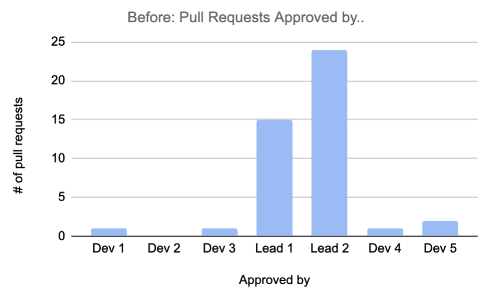
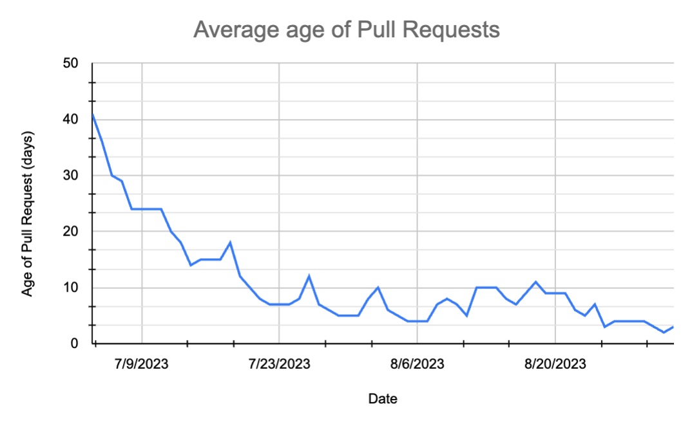
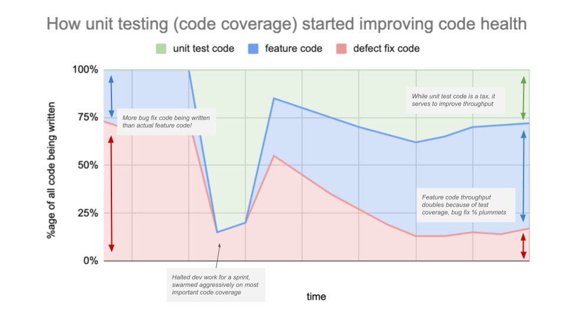
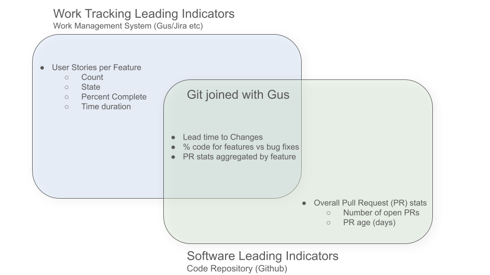
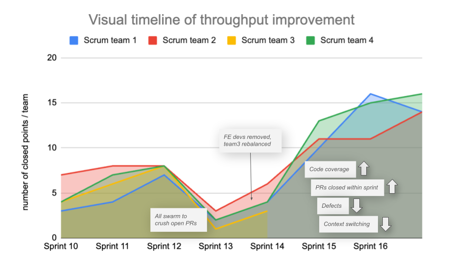
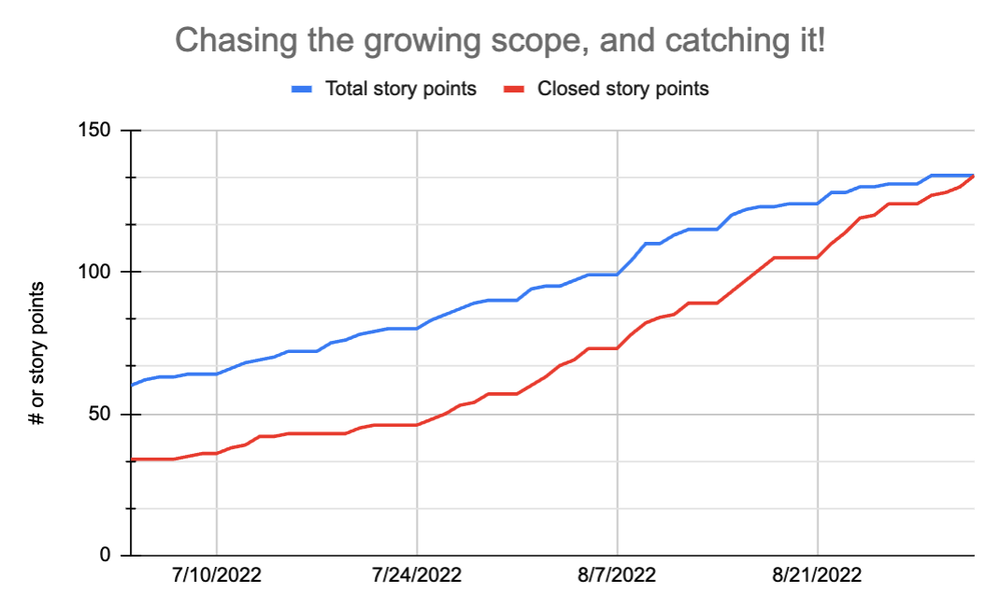

*Abstract: We did it! Delivered a major software project in record time! Our customers were happy, and we got a ton of funding, but then, the troubles started. There are plenty of stories out there around “how people built things from scratch”. This is the story of what happens next, i.e.* **after** *a successful launch.*

This is continuation from part1 where we set the stage and expand on the problem the software team was experiencing.. This section gets into how we resolved it.

---

## The road to improvement

### Re-balancing the team

Following the same principles laid out by Dr Goldratt in his book, we started to re-balance the flow of work through the system. First we made a decision to our business that we were going to reduce the front end team and repurpose them for other tasks. This was an ‘eye-brow’ raising decision. “You’re already so slow in shipping features, and you’re telling me you’re going to further cut capacity in your team?”. I can only imagine how our business stakeholders must have felt at this time. Do these folks know what they are doing, they must have thought. I’m just grateful they went along with our decisions.

We repurposed these front-end developers to start doing manual testing in QA. This was another unpopular decision. Developers like to create code, not test code. But in order to succeed, it required us to position our players in the right place in the field.

As we removed the front end development team, we also removed duplicative roles that had formed by the agency who had provided the front end teams. There were no longer going to be multiple leads (one from the agency and one from the company). Everyone had to align to a single lead for the scrum team.

When we thinned out the front-end developers, we actually ended up removing a whole scrum team, and consolidated the remaining developers, bolstering the remaining scrum teams. 

We even took some of the released capacity (the product owners, and converted them to full time scrum masters to the remaining teams. Prior to this the scrum master role was being dual-hatted by one software engineer in each team. This was causing context switching for that dual-hatter and she wasn’t able to do a good job for either role. This issue was resolved with the full time scrum masters.

### PRs - Spreading the love! 

We also made another shift. We brought other engineers into the mix and asked them to help out with reviewing the backed up PRs. For the first sprint, this was a little tough, since, except for the leads, no one really understood how the system worked end to end. For one to review and approve a pull request, one had to know what that feature was trying to do and how it may interact with the rest of the code base. 

The leads took a little time educating other engineers how the application had been laid out. Within the subsequent sprints, this tactic started bearing fruit! The number of Pull requests started to drop which also started reducing the average age of the pull request. 

This tactic also helped our team in another way.. All developers started to understand the application more deeply and it raised their overall awareness of all the moving parts. This actually made them better developers! They started to anticipate how their code was going to interact with the rest of the application, thus improving the quality of their future PRs. Aren’t virtuous cycles a thing of beauty?

|  |  |
| --------------------------------- | -------------------------------- |

Our PR age dropped from 40 days to less than 1 week: which is what we wanted for our release strategy. As mentioned earlier, our CICD pipeline was on a bus schedule, shipping every 2 weeks. Now, we were finally starting to complete our committed points within the sprint, in time for the bus.

### Scope management

Both business and engineering had realized that to be successful, the groups had to work closely together. To start, engineering got support from the business stakeholder to allot the next upcoming sprint to reset, and work down the tech debt. In this case, it meant getting the atrocious PRs down to size.

The product team baked in a specific must-do requirement for each sprint within our “definition-of-done”. This was to ensure that, moving forward, there was going to be 100% PR closure rate: each PR opened for a sprint was going to be reviewed and closed within the sprint. Doing this automatically started to close all the user stories targeted for that sprint.

Another tactic the engineering team used was to use confidence bands. Instead of the ‘all-or-nothing’ approach, engineering leads defined confidence bands for all the to-be-developed features, depending on the understanding of the feature and the scope of work required for that feature. These bands were 100%, 70%, 40% and 10%. 

This allowed business stakeholders to evaluate what was truly important for delivery and make some tradeoff decisions. This tactic also relieved pressure on the engineering team; the cognitive load of a sword hanging over the team to finish everything melted away.

 The team also snapped the line on how many points were scoped for the project. And reviewed the scope increase a few sprints later. What we found was that the scope had almost doubled from the original number of points planned. While scope expansion is common in agile, this was a large amount of increase, and was largely coming from three sources:

- A large amount of unplanned points to close out defects, and
- features too optimistically scoped,
- Extra stability work the team decided to do for monitoring, and deeper performance testing

This transparency and awareness helped us not be too unrealistic about the upcoming sprints and pace ourselves better. We also made a note to audit the defects to see if these defects were truly due to bugs or unclear requirements. 

### Pragmatic code coverage

As mentioned earlier, we knew that our code coverage wasn’t great. However, we really could not afford to go back and cover all the code. So we decided to add coverage pragmatically. Through some of the developers that we had removed from the front-end, we bolstered up strong test coverage for critical common code base. Until we re-architected the application, this code base was always being edited by most developers. This strategy of selective code coverage helped with the merge conflicts by punting the issue to the developer the moment she broke the code. 

Each developer had to run these unit tests first before they could commit code and send in the pull request because the people reviewing the pull requests were naturally going to decline the requests if the unit tests were failing. This ensured the code coming from the developers was mostly regression proof. 

The developer was also expected to write a reasonable level of unit tests to cover the new feature they were developing. This continued to add to the corpus of the unit tests, and future commits were able to check against this functionality before being sent in for review. This created another virtuous circle!

We implemented this strategy by first completely halting feature development for a sprint and devoting all developers to focus on writing extensive unit test coverage for some of the most common code. After that, we made a requirement to all developers to submit their new code with some modicum of coverage. While It was bumpy in the start, we soon started to see that our throughput of code being written for features compared to the code being written to fix defects started to increase. In other words, cleaner code was being sent in by developers to begin with, and therefore fewer and fewer defects were being caught downstream. Unit test code is akin to paying your taxes. It definitely takes some bandwidth from your developers time to write those tests, but just like taxes serve to improve our roads and bridges, and improve our infrastructure and personal security, these unit tests started providing a cleaner code base which started streamlining the flow of our work.

### Defining leading indicators

The stage was set. We had made several changes to the team structure and processes and now we need to see how they were faring. The challenge was that we did not have any time left, only 4 sprints, and we needed to have some **daily** signals to see whether or not the changes we had made were making a positive impact. Therefore, it was extremely important to choose the right leading indicator here; the consequences of choosing the wrong leading indicator would result in the team failing to deliver, and that would not bode well for my team, and also for the company. “PR age”, as mentioned earlier, was definitely on top of the list of our leading indicators. But what else did we need in our car dashboard to see if the car was getting more efficient? This was already on the fingertips of our lead engineers and one short conversation helped us identify them.

Another great leading indicator was looking at how the ‘state’ of our user stories was tracking over time..

| User Story State     | # of open user stories |
| -------------------- | ---------------------- |
| New/Unassigned       | 40                     |
| In Development       | 24                     |
| Ready to Review      | 60                     |
| Ready for QA testing | 10                     |
| Ready to deploy      | 30                     |

The state of the user stories tells you a story. Too many in New/Unassigned story means the team is backlogged and likely carrying over work from the prior sprints. To many in “Ready to Review” tells you that developers are done and now waiting for someone to review and approve their code so it can be merged together. Too little “Ready for QA Testing” means the QA team is idling and waiting to test in the QA and Integration environments. Tracking how the % change for each of these states was a useful indicator if things were getting healthier or going the other way.

We made another interesting observation around %age completed user stories: We saw that while a software team may point a user story to, say 3, points, it was sometimes taking **weeks** to close out that user story. We had a standard two-week sprint and user stories taking longer than that, was a clear signal of delays. Therefore, we needed to track not only the duration, but also the “rate of change” of the duration of completed user stories. If the rate was negative, that meant the stories were completing faster (good!), if the rate was positive, it meant the age of the stories was growing (bad!).

Finally there were multiple *must-have* user features for Dreamforce and our business stakeholders wanted a way to know in real time how the health of each feature was, and not wait for the end of the sprint, since we were at the end of the rope. This meant we needed to cut all the above leading indicators by features. In summary, after numerous conversations with the leads and product teams, these were the leading indicators we decided to track

- Number of open PRs
- PR age duration in days , plotted daily
- The count of state of all user stories, plotted daily
- % completion of each user story.
- Age duration in days of completed user stories
- Rate of change of age duration of completed user stories
- % of commits for features vs defects.

All the above indicators needed to be measured as a composite number, as well as cut independently for each user feature.

All these metrics were manually available by going into certain places within Github, or by creating some custom reports in our work management system ([Gus](https://developer.salesforce.com/blogs/engineering/2014/08/meet-gus-keeping-salesforce-agile)). Eventually I was going to need a dashboard which brought them all together for me.

### A quiet and effective way to track progress

One of the struggles that you have when you are in the executive position is that you don’t have a deeply visceral understanding of how things are truly progressing at the ground level. In normal circumstances, you don’t really need it either. You have weekly project reports, steering committee meetings and 1:1s with the leaders that report to you to get a general idea on how things are progressing. 

With just a few sprints left and my team’s reputation on the line, this was *not* a normal circumstance. I also could not start setting up daily meetings to gauge progress, which is typically what I had seen other executives do who were in my position in the past. Those are extremely disruptive for the folks who need to be doing the work and also tend to drive the morale low. So I had to come up with my own unobtrusive way to know exactly how the development was progressing. My approach was to create a console customized to track the leading indicators we had set up. So, I wrote a simple product requirements document, defined the data sources, and brought together a data product manager and a data engineer who reported to me, freed their capacity for a few weeks, and asked them to build a data pipeline and a dashboard for me. In essence, we created a tiny scrum team to do meta-work, aka the work for the work. 

**The magic of a 2-person team:** It was crucial to keep this small side team to only 2 people. For rapid and relatively less complex projects, my experience has been that two people work much more effectively than 3 or more. The reason behind this phenomenon is that the two don’t have to schedule meetings by coordinating for availability, they are dedicated to the project and work closely with each other to get stuff done. I also gave the two a direct line to me so I could unblock them with any access issues, confusion on the requirements I’d written, technical constraints they were running into. They also gave me very regular async updates through Slack, pulling me into meetings to do demos to show work-in-progress. The product manager did an especially good job in keeping me in check with all the new requirements I kept adding on to the project! 

What was required here was to join our work management system with github data. The team married the epics under way with the true amount of actual PRs coming in for them. 

Our approach was to manually pull the data from the code repository hosted in github and our work management system, Gus. Initially we were uploading this data into our warehouse daily. Our visualization system, Tableau of course, was hooked up to the warehouse. In time we automated these integrations.

The key to join Git and Gus data was the user story ID. As mentioned each Pull request had, in its description the ID, and ofcourse the user story ID obviously was available through 

All the above indicators needed to be measured as a composite number, as well as cut independently for each user feature.

We brought all these different data points from both Github and from Gus into our data warehouse on a daily basis, created a few more datasets which would start amalgamating historical information using the Slow Changing Dimension Type-2 ([SCD](https://www.sqlshack.com/implementing-slowly-changing-dimensions-scds-in-data-warehouses/)) format, and then we joined the data across to get visibility on how the development teams were faring within the software leading indicators per feature. 

I recall using this dashboard on a daily basis to assess team health during those times. When a leading indicator started going south, we were able to quickly swarm, do a root cause and put it back on track.

### Nursing back to health

As we started to see a reduction of PR age and the sheer number of PRs itself, we saw that while the overall commits naturally dropped (due to reducing front end developer capacity), the actual % of code commits for application features started to increase while the number of commits for defect fixes started to drop. This was an encouraging sign.

### Results

As the work started to accelerate, the team started finishing features sooner than expected, and with fewer defects being caught, the developers had to do much less context switching from developing the next feature to fixing defects from code they had written in the past sprint. 

We hit all our delivery milestones, went into the final end-to-end performance testing window on time, and successfully emerged on the other end. Our business stakeholders were elated, and their confidence in our engineering team was restored once again.

An added challenge was that this was a moving target. The scope kept increasing all the way to Dreamforce. Some of this scope increase was expected due to agile. Some was because of the extra work to write unit test code coverage. Some was just because of under-scoped points for a feature and the rest was because of the defects being filed and fixed along the way.

The scope increase graph almost looked like run-rate in a cricket match. In the end, however, the team was able to catch up because of all the organizational changes and process improvements.

Post dreamforce 2022, more goodness was to follow, with a much more rigorous release planning, more browser and device support, earlier engagement with business and customers and clear alignment of roles and responsibilities across Product and Engineering. 

Over the next year, the engineering team moved to the next level of maturity with highly automated QA functional and performance testing, much better code coverage, and getting even more streamlined.

Delivering the goods for this recent Dreamforce (DF 2023) had its share of drama and excitement with a melding of the onsite and virtual experience and an enhanced authentication experience, along with multiple video and platform capability enhancements. However, one area which stayed incredibly boring was the reliable, consistent software delivery schedule. The engineering team delivered like a well-oiled machine and did it without losing their shirts and working insane hours. The delivery engine was finally sustainably efficient.

I feel truly grateful for this journey. Because the story of this team’s evolution was sped up faster than other organizations, due to the time pressures of delivering major capabilities before each major event, we were also able to improve at a pace perhaps 10 times faster than regular software firms. We had no choice: the question was existential. But I’m so proud of how the team showed up. We re-balanced our team, changed our processes, obsessively drove to leading indicators, and slowed down to streamline the flow of work through the system. Convinced that this is ‘the way’, we are now on a journey of constant continuous improvement fueled by hard data. This is the way any firm should be run.

Perhaps the single-most memorable statement that resonates with me even now was a Navy Seals mantra that my lead engineer, a former marine, and someone who was integral for this transformation said when we were going through the change…

*“Slow is Smooth and Smooth Is Fast”*

All the graphs and pictures created for this article are available [here](https://docs.google.com/presentation/d/1K1dwkEt2xNQgKG3g04Z92HAUB8er2QmDSWoYmJrJ6GY/edit#slide=id.g2a53d60139e_0_0) and [here](https://docs.google.com/spreadsheets/d/1-IXHvwREgIM2nyRK7lPv-1iFAwRVSi-AbZ66NwkmNDY/edit#gid=974250378)

---
## Definitions

- [1] What are leading indicators? Taken from economics, leading indicators are signals early in a business cycle that give you the opportunity to influence the future since they are forward-thinking insights and predictions.

- [2] **What is a Pull Request?** This software engineering concept is simple. Multiple developers are churning out code. When their piece of code is sufficiently functional, they package this code (what is called a series of commits) and request the gatekeeper, somebody senior, to pull this new code into the overall code of the application. The gatekeeper checks if this code is in healthy shape, and that it won&#39;t break any other things in the software and merges this code.So a developer commits code a few times, and when she feels the feature is in good shape, sends the PR in. The PR can then be reviewed, commented upon, rejected, or accepted by the gatekeeper.

- [3] **What is unit test coverage?** Unit test coverage (also referred to as test coverage, or code coverage) is a piece of code written by the developer along with the feature code whose sole job is to test the functionality of that new or updated code. It attempts to verify if the goal that the code is supposed to accomplish is really being accomplished by calling that code with both working and non-working scenarios and looking for expected outcome (pass or fail)

- [4] **What is a user story?** A user story is an informal, general explanation of a software feature written from the perspective of the end user. Its purpose is to articulate how a software feature will provide value to the customer. Developers are assigned these stories and they work to convert them into functional software features.(*Source:* [*Atlassian*](https://www.atlassian.com/agile/project-management/user-stories#:~:text=Summary%3A A user story is,simply put%2C software system requirements.))

- [5] **What is a commit and how is it related to a Pull Request?** A commit is a set of lines of code that a developer has written and can package that to be sent to the main software code of the application. This is the time when her code leaves her laptop and is ready to be exposed to the world, critiqued by her peers etc. The best practice is to “commit early and often and let the sausage making be seen by all” ([ref](https://sethrobertson.github.io/GitBestPractices/#commit)). If developers delay their commits, they end up writing a lot of code, and when that code has a merge conflict with someone else’s code, it is incredibly hard to parse through the large body of merged code to find the issue, versus if it had been a smaller piece of more clearly traceable code commit. Github allows developers to pool a bunch of their commits into a Pull Request.

- [6] **Number of commits vs number of lines of code: What is a better measure?** Looking at commits is a better measure than the number of lines of code, as the commit signifies a block of functionality completed. It can be just 1 line of code but could be the one line which fixes a nasty race condition defect which took days to find. Ofcourse, the number of pull requests are even better than commits, as those signify complete features (or defects) being fixed and sent to the next level environment for testing

  
